

# Windows Basics

Room link: https://tryhackme.com/room/windowsbasics

## Executive Summary
- This room moves from basic Windows orientation to practical workstation administration and security operations.
- The screenshots show a complete beginner-to-practical flow: interface navigation, file handling, update lifecycle, software install/uninstall, and built-in protection layers.
- From an AppSec/Product Security perspective, this is critical foundation work because real security testing and hardening often starts with endpoint visibility, host controls, and operational hygiene.

## Walkthrough (Evidence + Analysis)

### 1) Windows workspace entry point: context, user types, and environment model
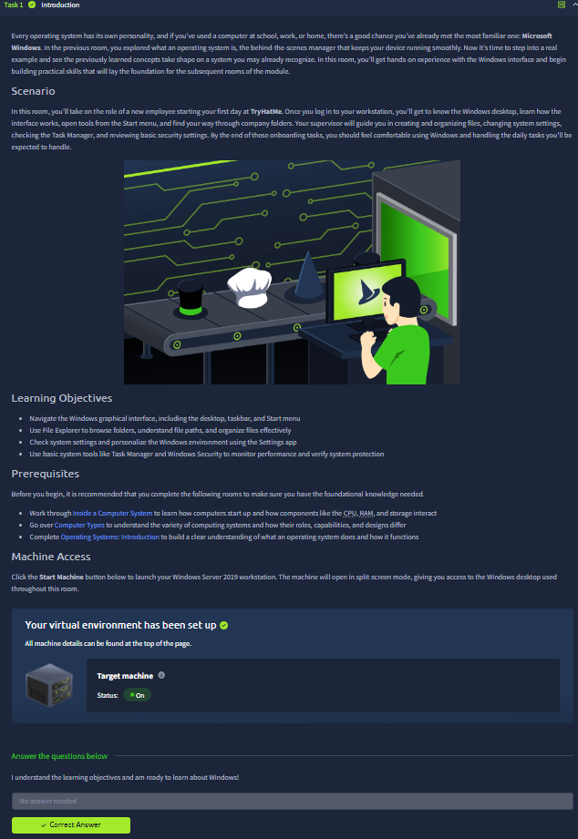

The first screen frames Windows not only as an OS, but as a day-to-day operational platform where account type and environment awareness shape what actions are possible. The text explicitly separates local and networked account concepts, which is important in enterprise systems where role and policy drive what can be executed.

The diagram and introductory content also establish a mental model of “where you are operating” before touching tools:
- workstation context,
- account context,
- privilege context,
- and policy context.

This is the right starting point for security-minded workflows, because most troubleshooting and hardening mistakes come from ignoring one of these layers.

---

### 2) Evolution + login model: why Windows behavior differs across generations
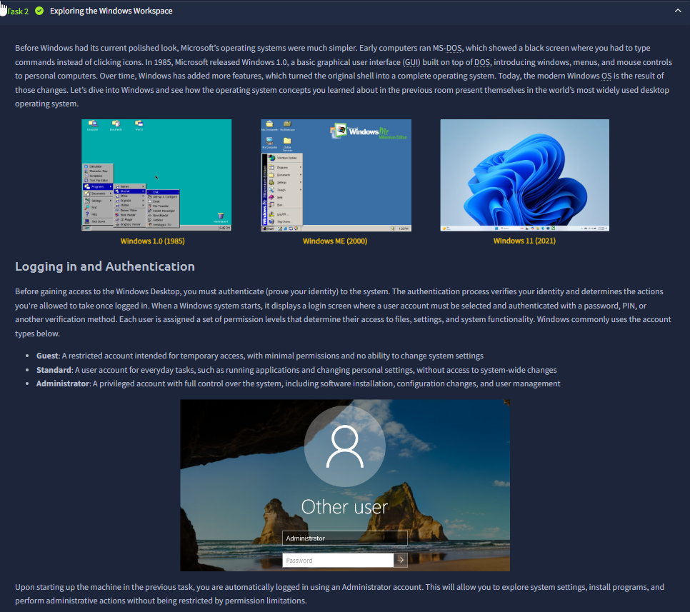

This evidence connects historical platform evolution to practical interface and security behavior. Even though the screenshots mention versions (older to modern), the deeper value is understanding that security defaults, management panels, and update behavior evolved significantly over time.

The login panel focus is also useful: authentication is not just UI. It is the gate controlling session creation, token issuance, and post-login resource visibility. For AppSec learners, this reinforces why endpoint-side account/session understanding complements web-layer auth testing.

---

### 3) Desktop anatomy: taskbar, launch points, and fast admin navigation
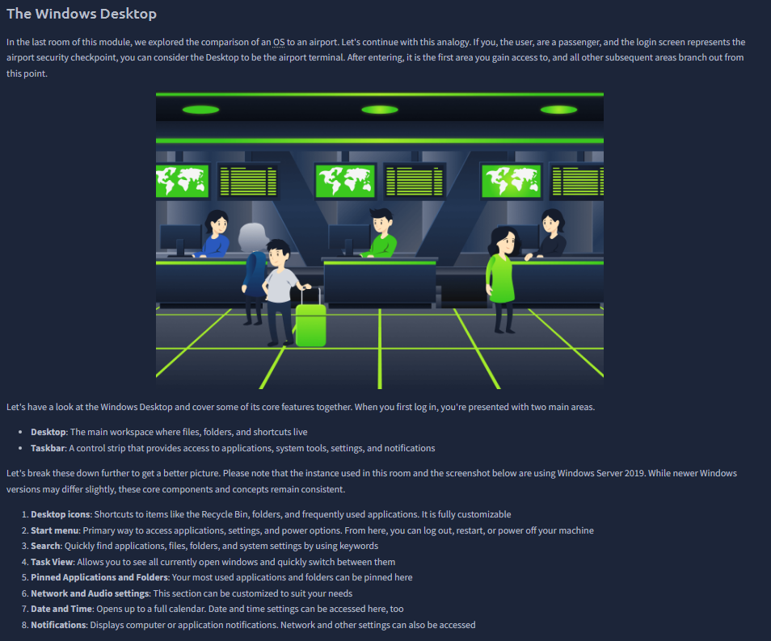

This screenshot breaks down the Windows desktop into actionable components. The value is not visual familiarity alone; it is operational speed:
- where app launches happen,
- where background/service notifications surface,
- where context menus expose quick admin routes,
- and where system state is immediately observable.

In practical investigations, these UI anchors reduce time-to-diagnosis. For example, the difference between opening Settings, Control Panel, or Task Manager first can change how quickly a configuration or performance issue is isolated.

---

### 4) Start menu and pinned tools: discovering built-in administrative capabilities
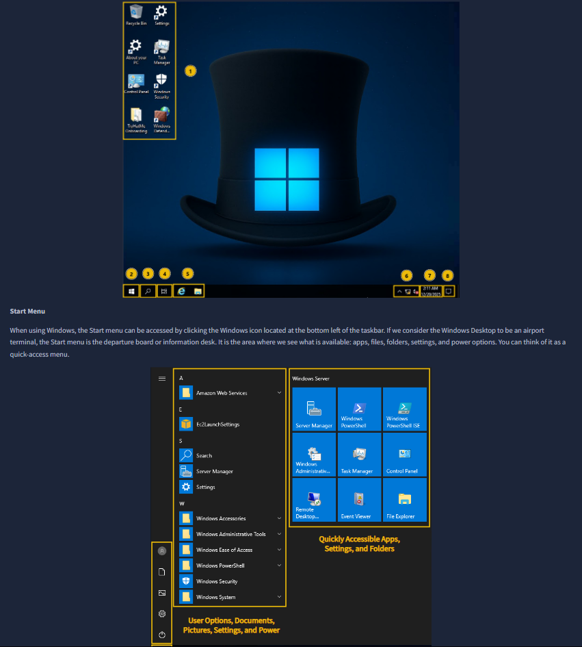

The task sequence here teaches guided discovery: use Start/search to find core system modules instead of memorizing every path. This mirrors real admin behavior on unfamiliar hosts.

Important takeaway: Windows provides multiple routes to the same function (search, pinned app, Run dialog, direct panel path). Knowing this redundancy improves resilience when one path is restricted by policy or unavailable in a hardened image.

---

### 5) Built-in tools + About PC: baseline host inventory before action
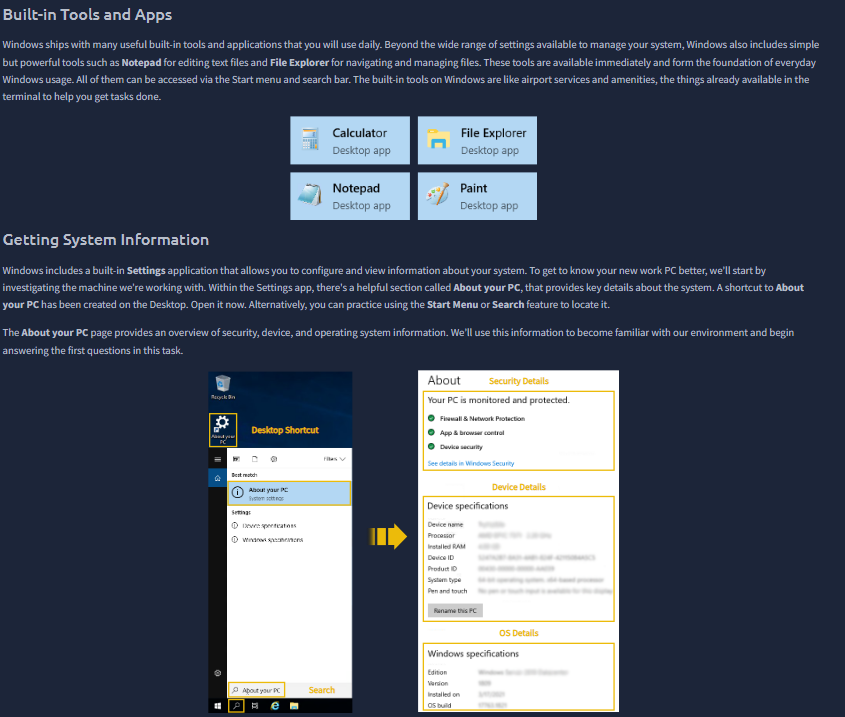

This is a strong operational screenshot because it combines two concepts:
1. Built-in utility ecosystem (Notepad, File Explorer, etc.).
2. Structured host inventory via “About your PC”.

The right panel highlights security details, device specs, and OS details. That triad is exactly what you want before performing changes:
- Security details: current protection posture.
- Device specs: capacity constraints.
- OS details: compatibility and patch context.

In real environments, skipping this baseline often causes wrong assumptions (unsupported installer, mismatch architecture, or wrong troubleshooting branch).

---

### 6) File exploration workflow: folder hierarchy, targeting, and verification
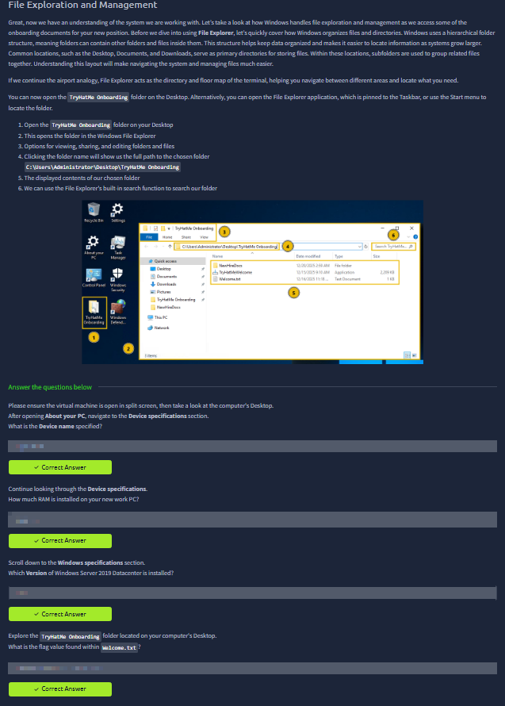

The evidence demonstrates a practical file-navigation workflow with numbered steps: locate target folder, open in Explorer, validate path bar, inspect file list, and use search when needed.

What matters here is disciplined verification:
- confirm current path,
- confirm object type (folder/app/text),
- and confirm expected artifacts before execution.

This is directly security-relevant: accidental execution from wrong path or trust in mislabeled files is a common endpoint risk pattern.

---

### 7) Update lifecycle and installation channels: patching as security control
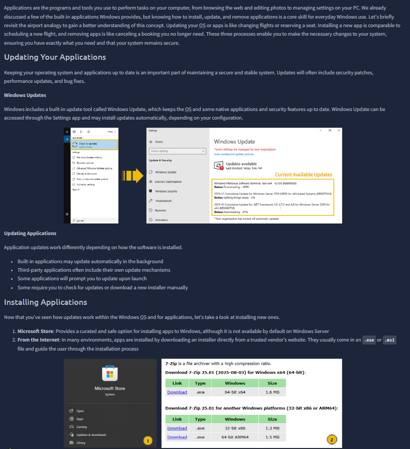

This screenshot cleanly separates OS update path from third-party application update path. That distinction is essential:
- Windows Update governs OS/security component patches.
- Third-party apps may self-update, prompt, or require manual installation.

The 7-Zip example also introduces source/channel trust. Installation mechanism matters as much as the software itself. In secure operations, update cadence + source validation + integrity checks define whether your endpoint remains defensible over time.

---

### 8) Hands-on install/uninstall operations: controlled software lifecycle
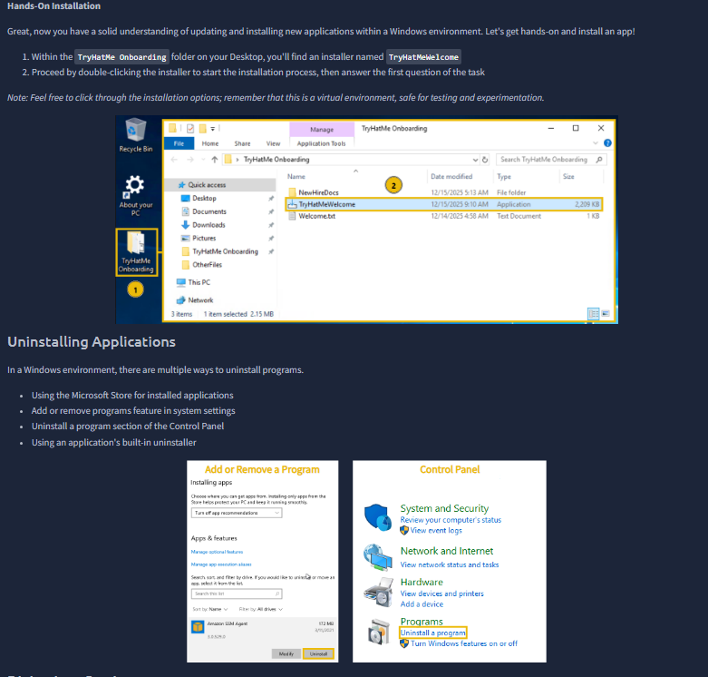

This evidence transitions from theory to task execution. It shows the operator opening a provided installer from an onboarding folder, then reviewing standard uninstall routes (Settings, Control Panel, app uninstaller).

Security-relevant interpretation:
- installation introduces code into trusted execution paths,
- uninstallation reduces attack surface,
- and software lifecycle control is a preventive measure, not just housekeeping.

A stable endpoint is not only “updated”; it is also free of unnecessary or unmanaged software.

---

### 9) Native Windows Security console: practical detection workflow
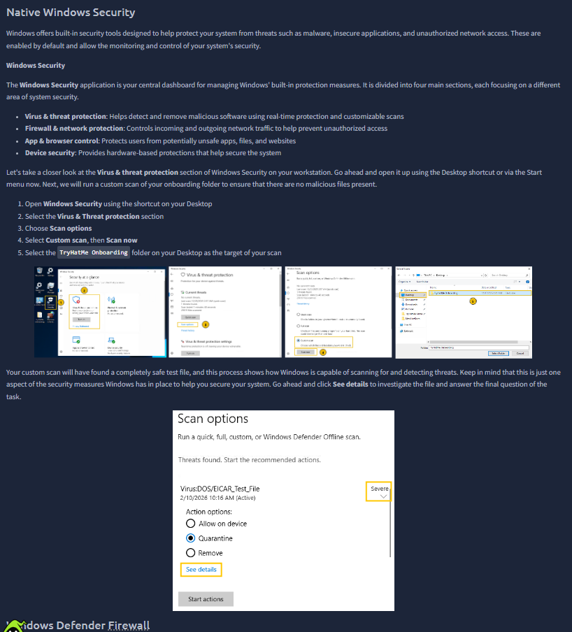

This is one of the most important screenshots in the room. It demonstrates moving through Windows Security sections and running a targeted custom scan on a chosen folder.

The process reflects real triage flow:
- open protection dashboard,
- choose threat-focused section,
- select scan mode,
- target specific location,
- review findings/details.

The screenshot emphasizes that built-in protection is operationally useful only when the operator knows how to scope and review scans. This is endpoint security in practice, not just a checkbox feature.

---

### 10) Defender Firewall and advanced rules visibility
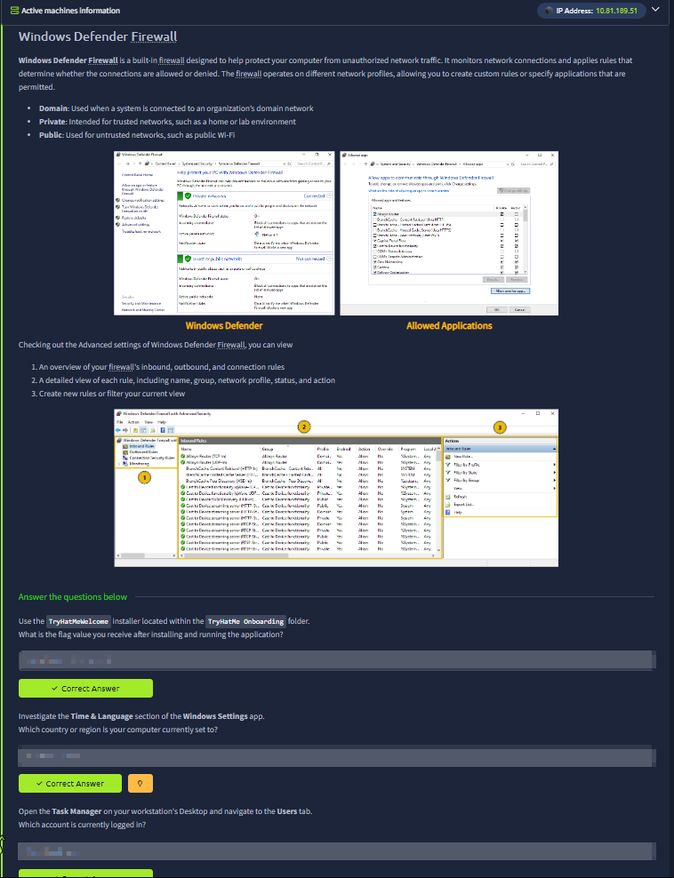

This evidence explains profile-based firewall operation (domain/private/public) and then drills into advanced rule management. The numbered panel guidance points to inbound/outbound rule lists and filtering/control actions.

This is foundational for understanding host-level traffic control:
- inbound rules control what can reach local services,
- outbound rules control what local processes can reach externally,
- profile context changes behavior based on trust level of current network.

For AppSec-minded work, this clarifies why app behavior in dev/test/prod can differ by host policy even when code is identical.

---

### 11) End-to-end practical validation on workstation artifacts
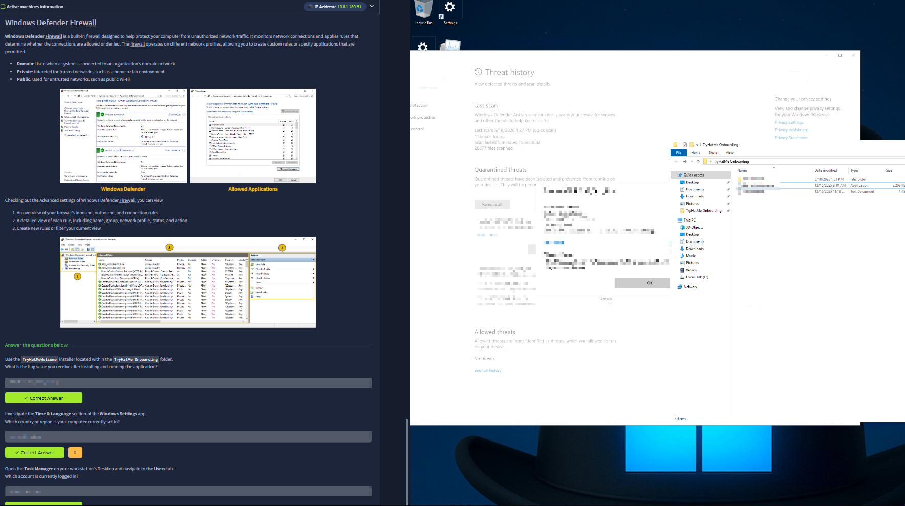

The final evidence combines the task pane with the active workstation window, showing that answers were derived through actual interaction (scan history/details, onboarding files, and system tools), not guesswork.

Operationally, this is the strongest closing signal:
- inspect,
- verify,
- cross-check,
- then conclude.

That process discipline is exactly what carries into incident response and secure operations. The room ends by reinforcing that Windows administration and Windows security are inseparable in real environments.

## Key Takeaways
- Windows security posture depends on both configuration and operator workflow quality.
- File/path discipline, update hygiene, and software lifecycle control are core defensive habits.
- Native controls (Windows Security + Defender Firewall) become powerful only when used with targeted, evidence-driven procedures.
- Baseline host inventory before action prevents many avoidable operational and security errors.
