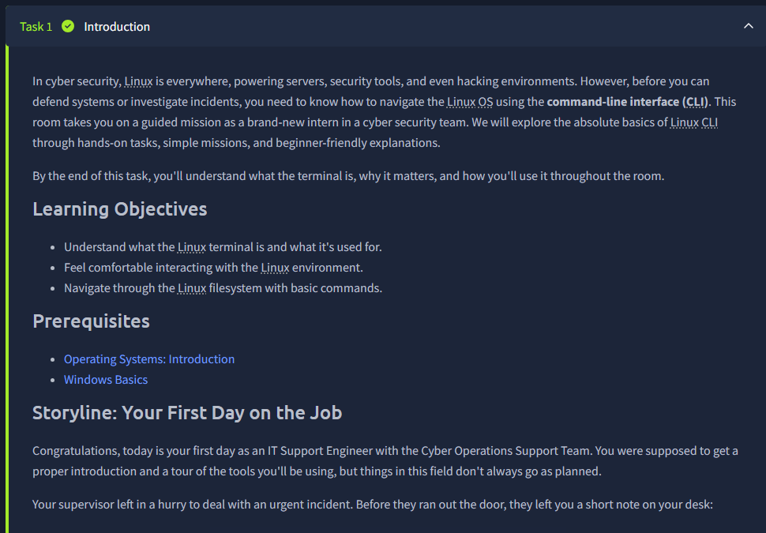
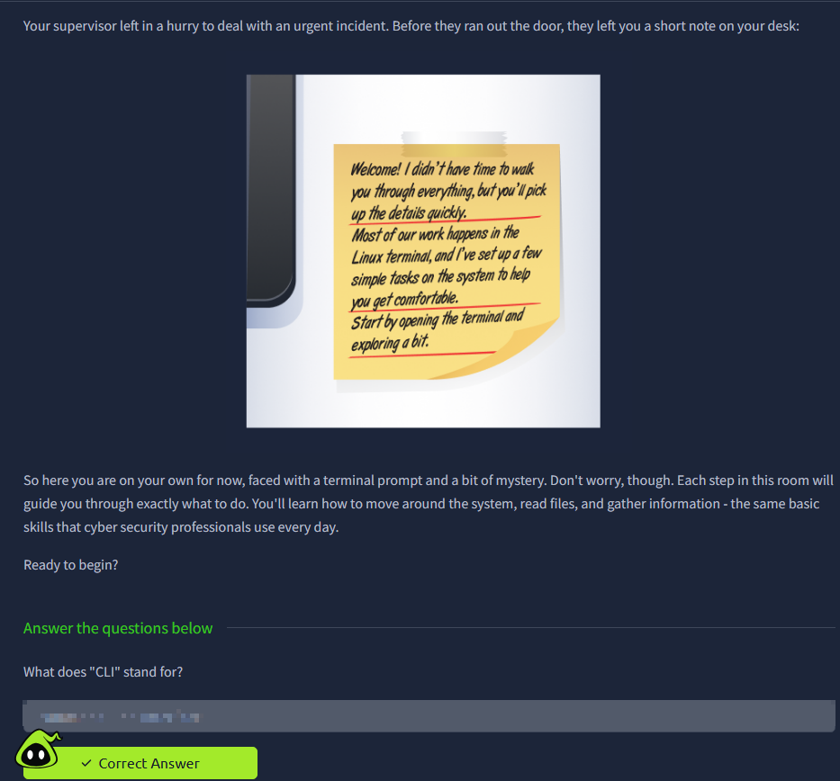
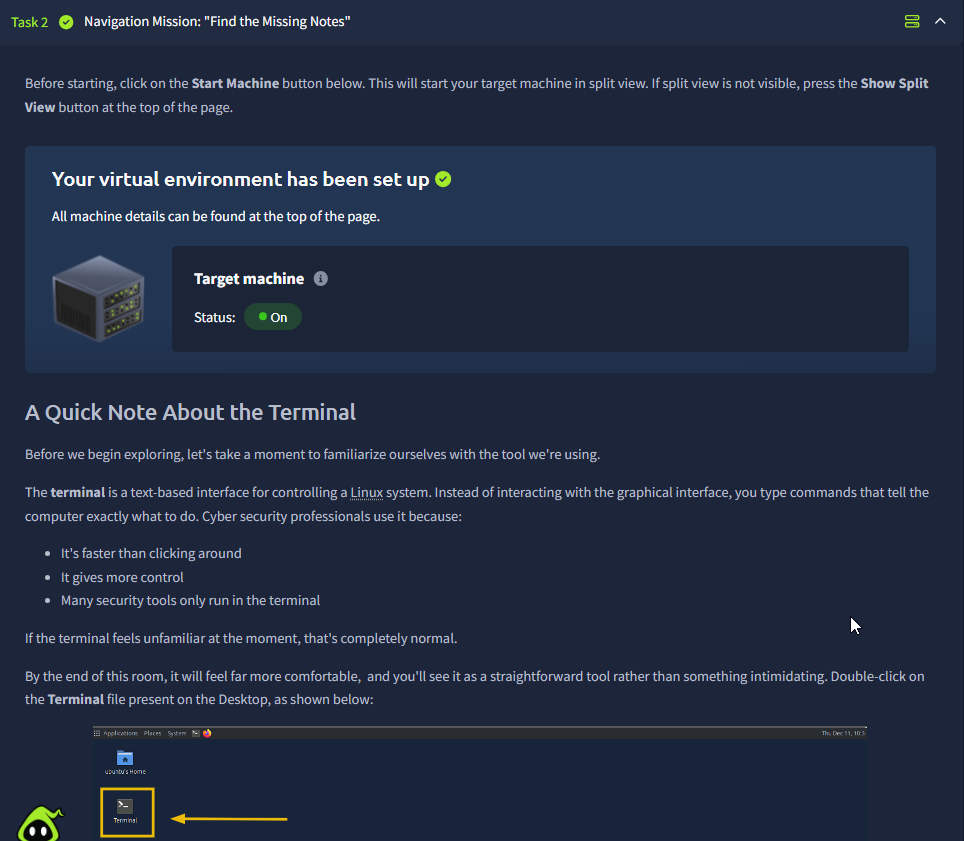
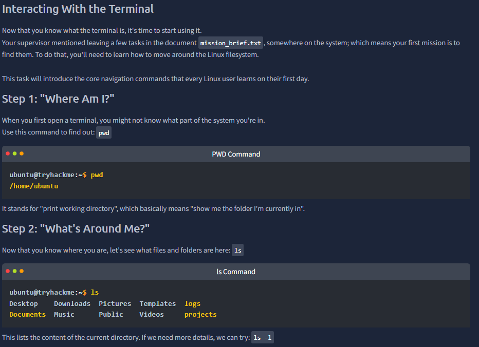
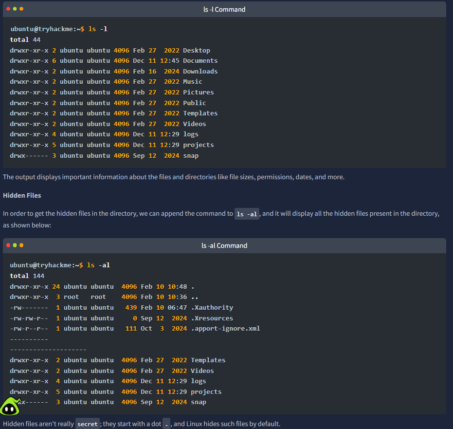
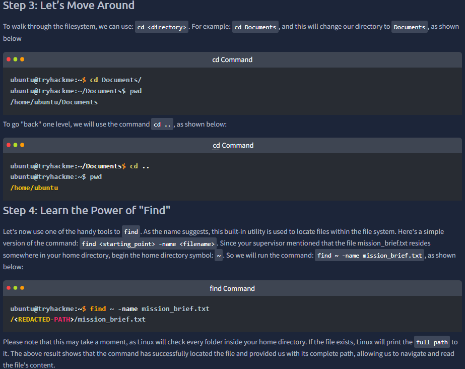
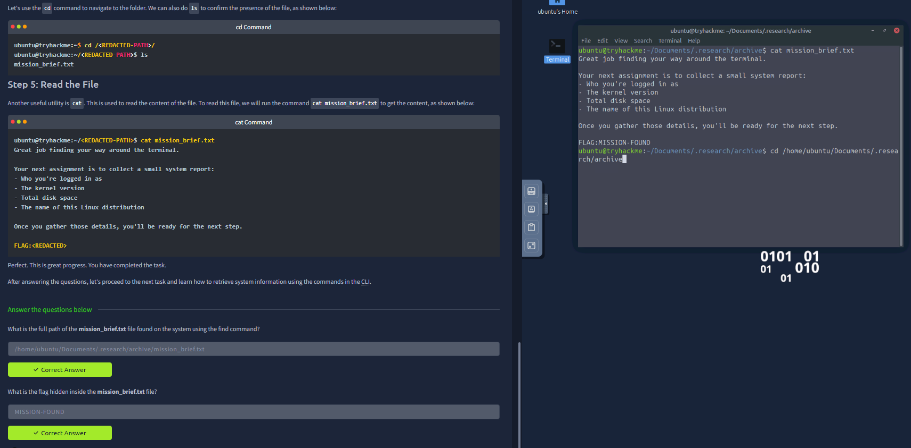
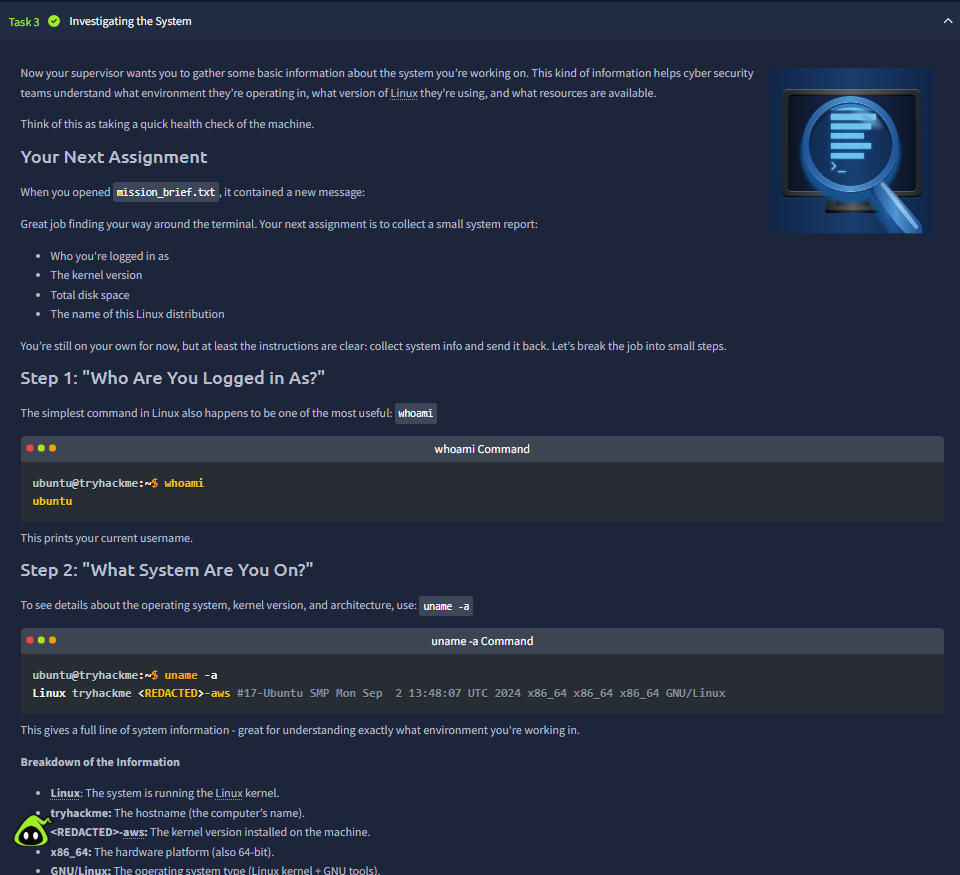
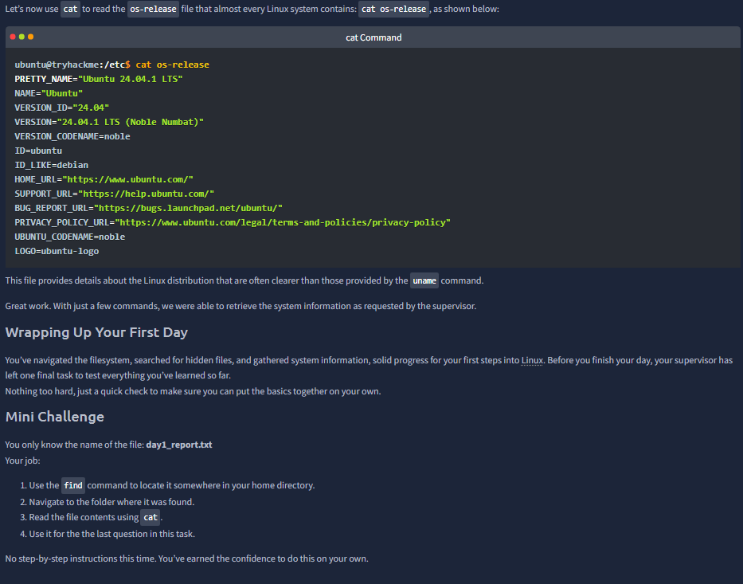
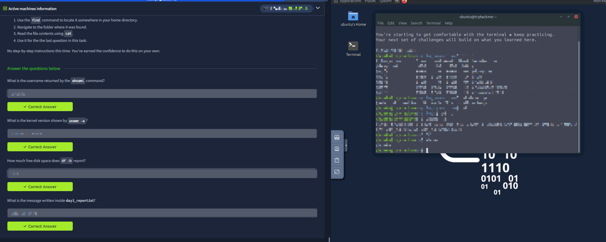



# Linux CLI Basics

Room link: https://tryhackme.com/room/linuxclibasics

## Executive Summary
- This room teaches Linux terminal usage as an operational workflow, not just command memorization.
- The content progresses from orientation (`pwd`, `ls`, `cd`) to discovery (`find`) and evidence extraction (`cat`, system profiling commands).
- For AppSec and security engineering, this is core muscle: fast host navigation, reproducible checks, and reliable data collection directly from the command line.

## Walkthrough (Evidence + Analysis)

### 1) Mission setup: why CLI literacy matters for security workflows

The opening scenario is intentionally realistic: your supervisor leaves an urgent handoff and expects you to continue independently from a terminal prompt. This mirrors real SOC/AppSec moments where context is partial and speed matters.

The screen frames CLI as a confidence-building path:
- move around filesystem,
- read files,
- collect actionable system details,
- and turn raw output into decisions.

The important message is that terminal work is not "advanced-only"—it is the default language of technical investigation.

---

### 2) Environment boot + terminal framing in split-view lab

This screenshot confirms machine state first (`Status: On`) before any command execution. That order is operationally correct: validate target availability before troubleshooting commands.

The "Quick Note" section explains why CLI remains dominant in security work:
- lower friction than deep GUI navigation,
- higher precision and repeatability,
- and compatibility with automation.

From a professional standpoint, this screen teaches setup hygiene: verify lab context, verify target, then start command-driven exploration.

---

### 3) Core navigation primitives: `pwd` + `ls` as reconnaissance baseline

Here the room introduces the first two commands that define terminal situational awareness:
- `pwd` tells you your exact current location.
- `ls` enumerates visible artifacts in that location.

This is equivalent to reconnaissance at filesystem level. Before editing, executing, or deleting anything, you establish where you are and what is present. The screenshot also shows realistic user home paths and directory names, reinforcing that command output is context-dependent and should be interpreted, not memorized.

---

### 4) Detail and hidden-surface discovery: `ls -l` and `ls -al`

This evidence expands simple listing into metadata-aware inspection:
- `ls -l` adds permissions, ownership, size, and timestamps.
- `ls -al` reveals hidden entries (dotfiles), including environment/config files often relevant in security reviews.

The hidden-files note is important: security-relevant artifacts frequently live in dot-prefixed files. Skipping `-a` means missing part of the attack or defense surface.

In real assessments, this is where basic triage starts becoming forensic: you’re no longer just "seeing names", you are reading trust and behavior signals from metadata.

---

### 5) Filesystem traversal + target search workflow (`cd`, `..`, `find`)

This screenshot demonstrates a practical search chain:
1. change location with `cd`,
2. move up with `cd ..`,
3. search by name using `find`.

The key operational benefit is deterministic discovery. Instead of guessing path locations, you use the system to produce the exact full path. That reduces human error and makes your steps reproducible in reports or incident timelines.

The room also subtly teaches patience: `find` can take time because it recursively traverses directories. In production hosts, this expectation management matters.

---

### 6) Verifying target and extracting contents with `cat`

After locating the file, the workflow validates presence (`ls`) and then extracts contents via `cat`. The side-by-side terminal evidence confirms successful navigation and read operation.

This is a strong habit pattern for security work:
- locate,
- verify location,
- read content,
- derive next task from evidence.

The mission note introduces structured system-report collection fields (user, kernel, disk, distro), which mirrors real host baseline checklists used in onboarding, operations, and incident response.

---

### 7) System profiling phase: identity and kernel context (`whoami`, `uname -a`)

This section transitions from navigation to host profiling. The commands shown provide immediate high-value context:
- `whoami` confirms execution identity.
- `uname -a` provides kernel/build/architecture context.

The screenshot’s breakdown is especially useful because it teaches interpretation, not just output capture. Knowing which field maps to hostname, kernel release, and architecture is what turns command results into actionable system knowledge.

For AppSec workflows, this helps when correlating behavior with environment constraints (architecture, kernel lineage, etc.).

---

### 8) Distribution metadata + independent mini challenge

The `os-release` output gives normalized distribution metadata (name, version, codename, URLs), often clearer than generic kernel output alone. This is useful for package management expectations, support windows, and compatibility assumptions.

The mini challenge at the bottom is pedagogically strong: it removes step-by-step spoon-feeding and asks you to chain earlier primitives independently (`find` → `cd` → `cat`). That is exactly how practical CLI competence develops.

---

### 9) End-of-task verification with split evidence

This screen demonstrates completion discipline: question panel on the left, raw terminal evidence on the right. It shows that answers are traceable to actual command output, not guesswork.

In professional environments, this “claim + proof” pairing is essential. It strengthens documentation quality and reduces ambiguity during review or handover.

---

### 10) Operational closure: confidence milestone from first-day command chain

The final screenshot captures the full room arc: starting from uncertainty and finishing with successful command chaining across navigation, discovery, and system profiling.

What is gained here is not just Linux syntax. It is a reusable operating pattern:
- establish context,
- enumerate safely,
- locate precisely,
- extract evidence,
- answer with proof.

That pattern carries directly into later rooms and real-world AppSec/SecOps tasks where CLI speed and evidence quality determine how effective you are under pressure.

## Key Takeaways
- Linux CLI is the fastest path to repeatable, auditable host investigation.
- `pwd`/`ls`/`cd`/`find`/`cat` form a foundational investigation chain.
- Metadata-aware listing and hidden-file visibility significantly increase inspection quality.
- Basic system profiling (`whoami`, `uname -a`, distro metadata) is mandatory context before deeper security actions.
