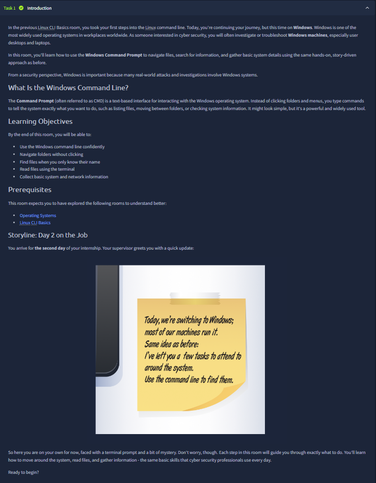
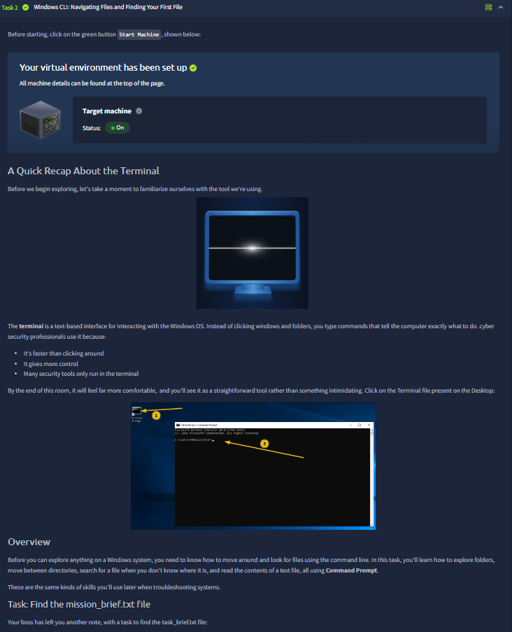
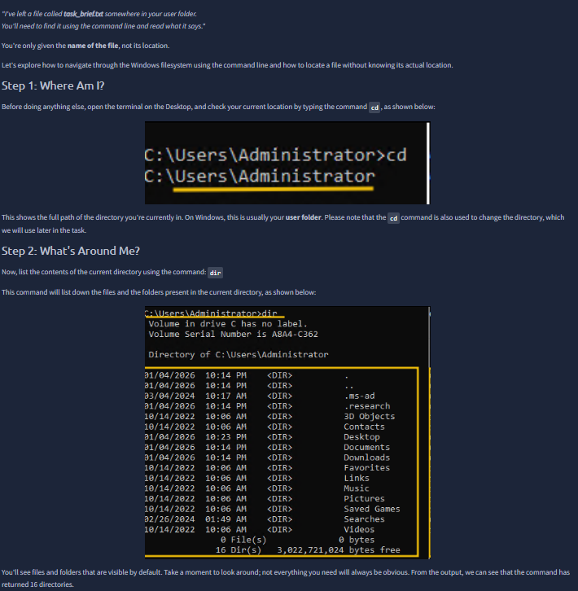
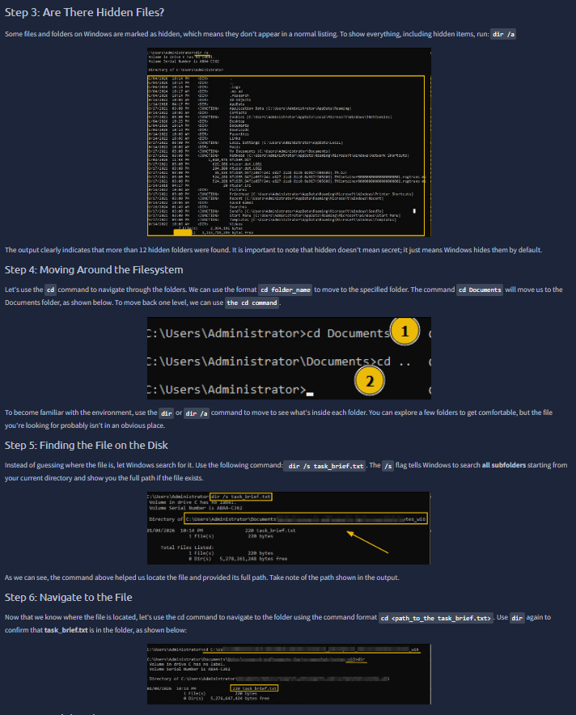
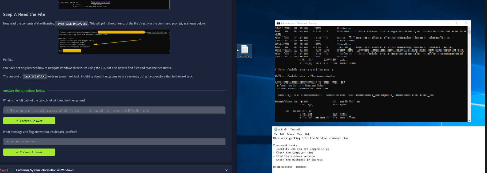
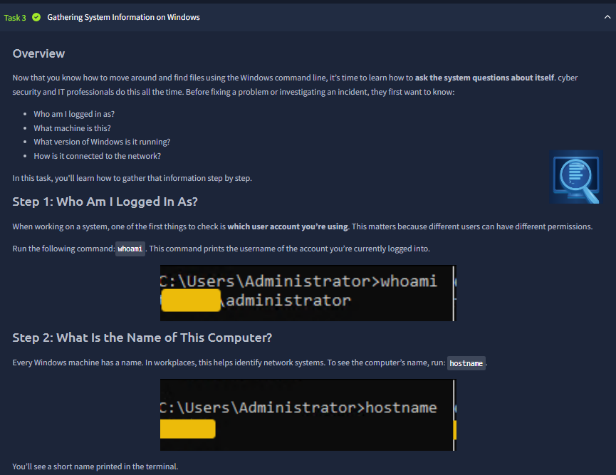
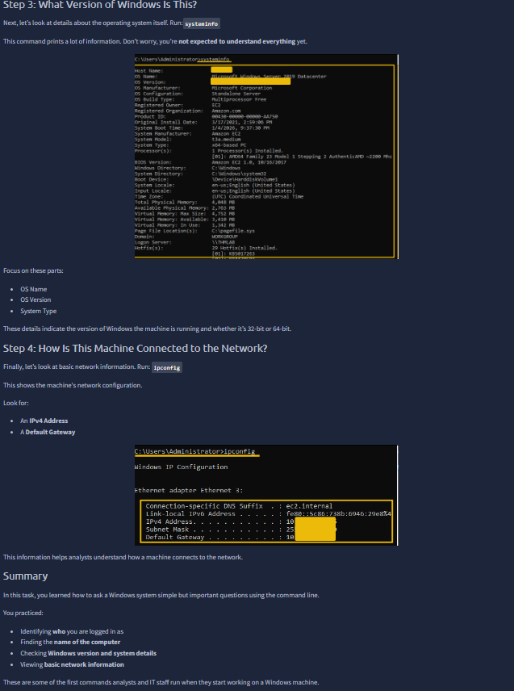
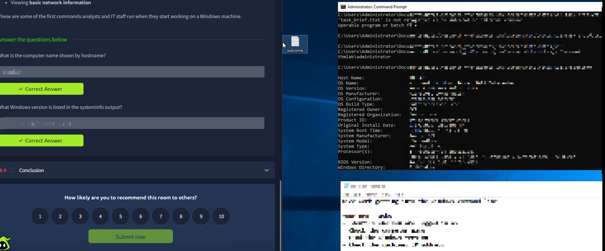



# Windows CLI Basics

Room link: https://tryhackme.com/room/windowsclibasics

## Executive Summary
- This room ports the terminal mindset from Linux to Windows, focusing on Command Prompt as a practical investigation interface.
- The flow is intentionally operational: identify current context, enumerate files (including hidden data), locate specific artifacts, and extract host/network details for reporting.
- For AppSec and security operations, this is foundational because real endpoint triage often starts with fast, reliable CLI queries rather than GUI-only navigation.

## Walkthrough (Evidence + Analysis)

### 1) Transition from Linux CLI habits to Windows CMD workflow

The first screenshot establishes continuity with the previous Linux CLI room while changing platform to Windows. That transition is important: command-line thinking is cross-platform, but command syntax and filesystem conventions differ.

The learning objectives on-screen are practical and security-relevant:
- navigate folders without clicking,
- find files when only partial context is known,
- read contents directly in terminal,
- and collect machine-level information quickly.

The internship-style note creates realistic pressure: incomplete handoff, immediate task ownership, and evidence-driven command usage.

---

### 2) Lab machine readiness + terminal recap before command execution

This screen validates operational prerequisites first (target machine is on) and then refreshes why terminal usage matters in security work:
- speed,
- control,
- and compatibility with tools that often do not expose full GUI equivalents.

The desktop-to-CMD callout confirms execution context and reinforces a good workflow pattern: verify environment state, open terminal, then start controlled exploration. This prevents “command troubleshooting” caused by environment issues.

---

### 3) Initial orientation commands: `cd` context check + `dir` visibility baseline

This evidence introduces first-step command discipline on Windows CMD:
- `cd` to confirm current working path (typically user profile area in this lab),
- `dir` to list visible folders and files in the active location.

From an investigation perspective, this is the minimum baseline before any search or extraction:
- know your location,
- know your visible surface,
- avoid acting blind.

The screenshot’s directory output also hints at scale: many standard folders exist, so targeted discovery is required rather than manual browsing.

---

### 4) Hidden data and path-driven retrieval (`dir /a`, `cd`, `dir /s`)

This section is one of the most important technical pivots in the room.

Key command behaviors shown:
- `dir /a` reveals hidden/system entries excluded from default listing.
- `cd <folder>` and `cd ..` handle controlled traversal.
- `dir /s task_brief.txt` recursively searches subfolders and returns full path context.

Security interpretation:
- hidden does not mean safe; it means less visible,
- recursive discovery is essential when location is unknown,
- full-path confirmation is required before reading or modifying artifacts.

This is directly transferable to endpoint triage and malware-hunt style workflows.

---

### 5) Content extraction with `type` + side-by-side validation of findings

After locating the task file, the room moves to content extraction using `type task_brief.txt`. The split view is valuable because it correlates instructional pane and raw terminal output at the same time.

What this proves operationally:
- path resolution was correct,
- file access was successful,
- extracted message drives next task stage.

This “find → verify path → read → derive next action” chain is exactly the pattern expected in technical investigations and structured troubleshooting.

---

### 6) System identity collection begins (`whoami`, `hostname`)

This screenshot starts host-profile collection through direct commands:
- `whoami` confirms account identity (critical for permission context),
- `hostname` identifies the machine label in an enterprise/networked environment.

Why this matters for security:
- same command can output different results by privilege level,
- host naming helps correlate endpoint data with inventory or incident tickets,
- identity + host pair is the minimum metadata for meaningful reporting.

The room correctly teaches these checks before deeper system detail queries.

---

### 7) Platform and network profile extraction (`systeminfo`, `ipconfig`)

Here the workflow expands from identity to system and network context:
- `systeminfo` provides OS edition/version/build/system type and broader machine metadata.
- `ipconfig` surfaces local interface configuration, including IPv4 and gateway context.

This is the point where terminal output becomes infrastructure intelligence:
- OS version influences patch/vuln assumptions,
- system type informs compatibility/tooling behavior,
- network fields explain reachability and segmentation context.

For AppSec and blue-team style tasks, these are baseline fields in nearly every endpoint handoff.

---

### 8) End-of-room proof: command output mapped to validated answers

The closing screenshot demonstrates correct completion practice: answer panel on the left and command evidence on the right. This is stronger than answer-only completion because it preserves traceability.

The conclusion section also shows a useful habit: rate/submit only after confirming data consistency across commands and prompts.

In professional terms, this room ends with a solid analyst pattern:
- collect via deterministic commands,
- verify via direct output,
- report with confidence.

## Key Takeaways
- Windows CMD supports the same investigation mindset as Linux CLI: context, enumeration, discovery, extraction, and reporting.
- `dir /a` and recursive search patterns are essential for finding non-obvious artifacts.
- `whoami`, `hostname`, `systeminfo`, and `ipconfig` form a practical minimum system profile for incident triage.
- Evidence-backed answers (not guess-based) are the standard for reliable security documentation.
