

# Operating System Security

Room link: https://tryhackme.com/room/operatingsystemsecurity

## Executive Summary
- This room connects operating system fundamentals to practical security outcomes: protecting confidentiality, integrity, and availability at host level.
- The progression is clear and realistic: understand the security model, recognize weak authentication/permissions/malware risks, then exploit poor operational habits in a guided Linux scenario.
- For AppSec learners, this module is critical because vulnerable applications usually run on vulnerable operating systems; host hygiene and account discipline directly affect application risk.

## Walkthrough (Evidence + Analysis)

### 1) OS security starts with the hardware–OS–software trust chain
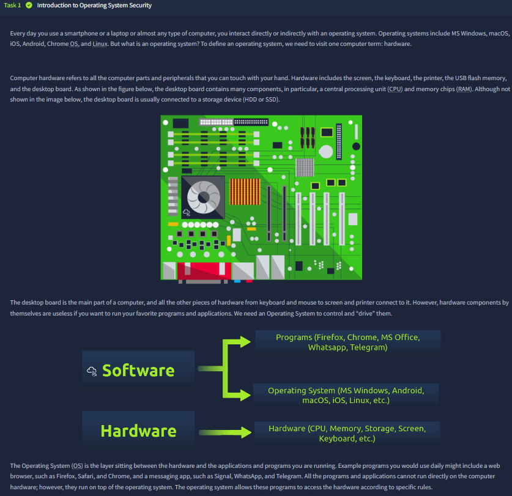

The first screenshot establishes the foundational architecture: hardware by itself is inert, and applications can’t safely or directly orchestrate hardware without an operating system enforcing structure and policy. The OS acts as the control plane between user software and physical resources.

Security implication:
- if OS controls are weak, every layer above it inherits that weakness,
- if OS controls are strong, applications gain a safer execution boundary.

This is a good opening because it prevents a common misconception: “security starts at app code only.” In reality, host-level enforcement is part of the same security story.

---

### 2) Data sensitivity + CIA triad as the room’s decision framework
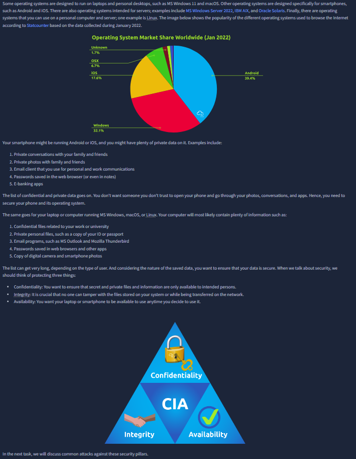

This screen links real user data (messages, credentials, files, banking access) with the CIA triad:
- Confidentiality: keep private data private,
- Integrity: prevent unauthorized modification,
- Availability: keep systems/services usable.

The market-share visual also reinforces attack economics: widely deployed OS platforms attract broader attacker interest because payoff scale is higher.

From a practical perspective, CIA here is not theory filler. It becomes the lens for evaluating each weakness shown later (passwords, permissions, malware).

---

### 3) Quick validation checkpoint
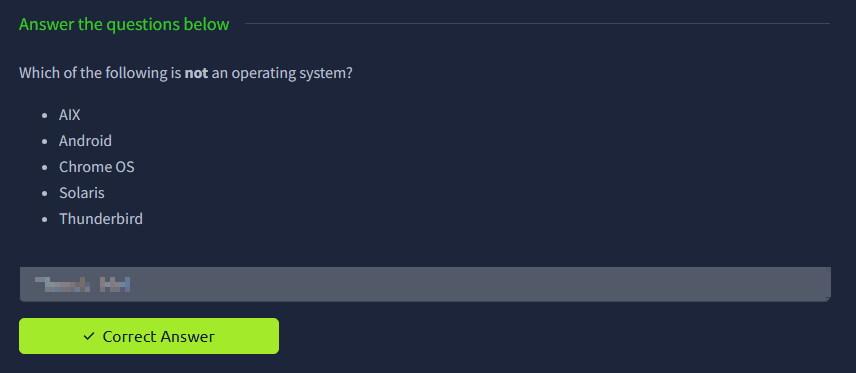

This checkpoint confirms concept separation between operating systems and applications. That distinction matters operationally because remediation ownership differs:
- OS hardening tasks (patching, account policy, host firewall) are not the same as app-level fixes,
- but both must align.

Even simple validation screens are useful in write-ups because they mark the transition from conceptual setup to applied security examples.

---

### 4) Common OS security weaknesses: auth, permissions, malicious code
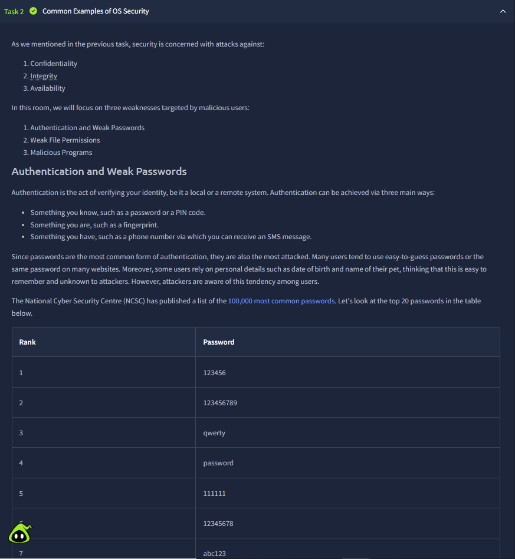

This screenshot is the structural core of the room. It narrows attack surface discussion to three high-impact vectors:
1. weak authentication/password habits,
2. weak file permissions,
3. malicious programs.

The password list illustrates predictable human behavior patterns (sequences, keyboard walks, dictionary words). This is critical because attackers exploit probability, not randomness.

Operational takeaway:
- weak credentials collapse confidentiality fast,
- especially when reused across systems.

---

### 5) Pattern-based passwords: why “looks random” can still be guessable
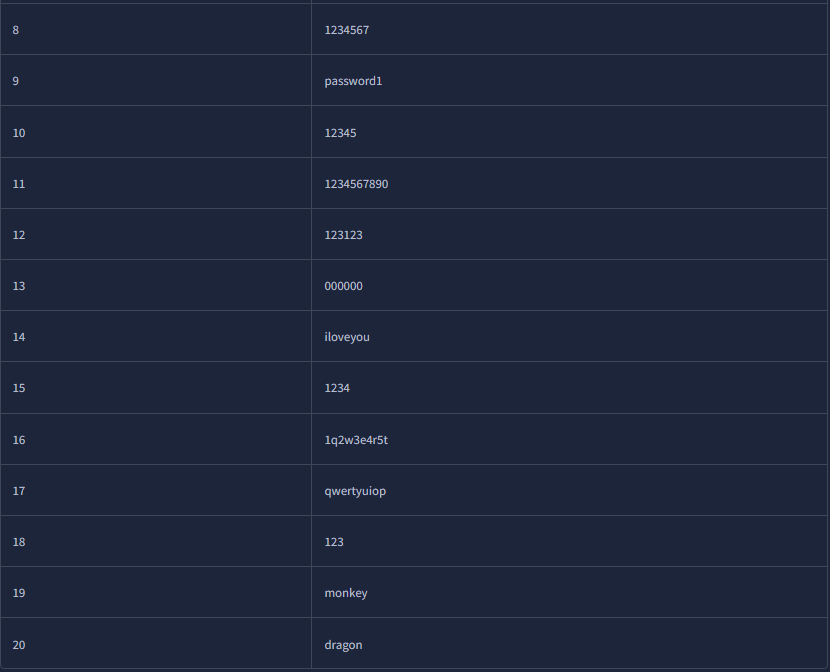

The continuation of the ranked password set is valuable because it demonstrates frequency over intuition. Many entries are short, patterned, or culturally common.

Security significance:
- attack tools (wordlists + rules) are optimized for exactly these patterns,
- “slightly modified weak password” often remains effectively weak.

This evidence supports policy decisions like minimum length, complexity with entropy focus (not cosmetic symbols only), and anti-reuse controls.

---

### 6) Weak permissions and least privilege in everyday language
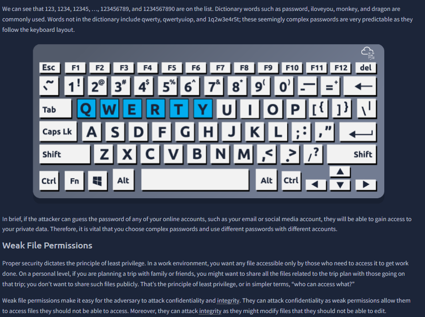

This screenshot blends two key points:
- keyboard-pattern passwords are predictable,
- over-permissive file access breaks least privilege.

Least privilege is explained in a practical way: only users/processes who need an asset should access it. If everyone can read/modify sensitive files, confidentiality and integrity both fail.

For AppSec context, this maps directly to deployment errors where app service accounts receive broad file/system permissions “for convenience,” creating lateral-risk opportunities.

---

### 7) Malware as CIA attacker: trojans (conf/integrity) + ransomware (availability)
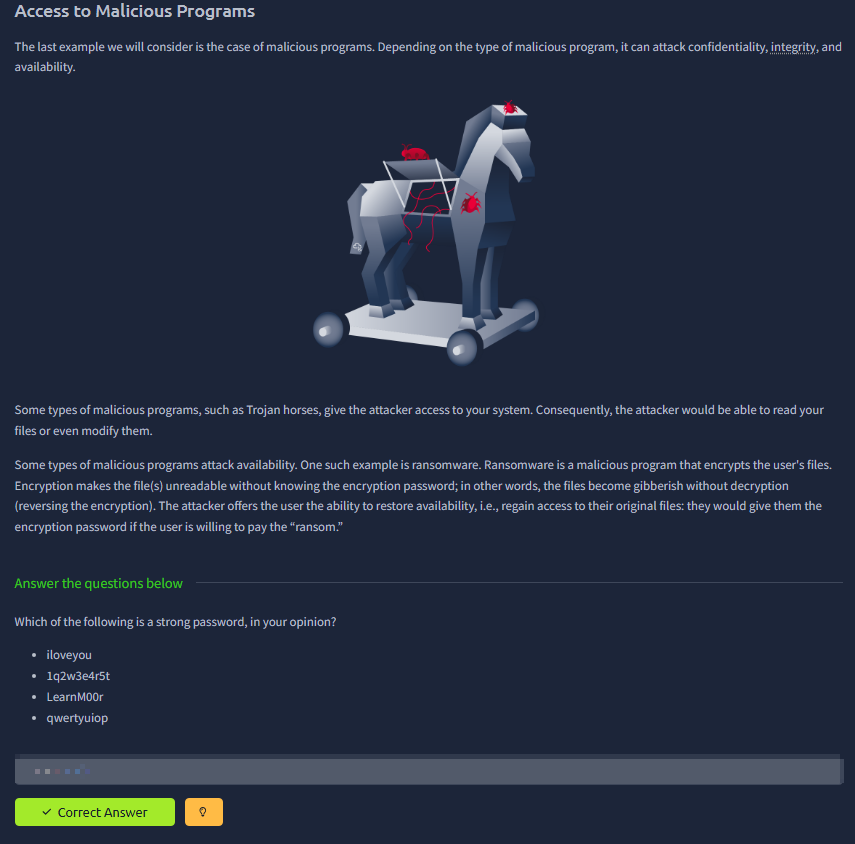

The room correctly frames malware by impact type:
- trojan-style access compromises confidentiality and integrity,
- ransomware directly targets availability by encrypting access.

This framing is useful because it helps triage teams articulate impact quickly using a common language. It also reinforces prevention logic:
- endpoint controls,
- secure user behavior,
- and containment mechanisms all protect CIA, not just one pillar.

---

### 8) Attack scenario setup: credential abuse and privilege escalation path
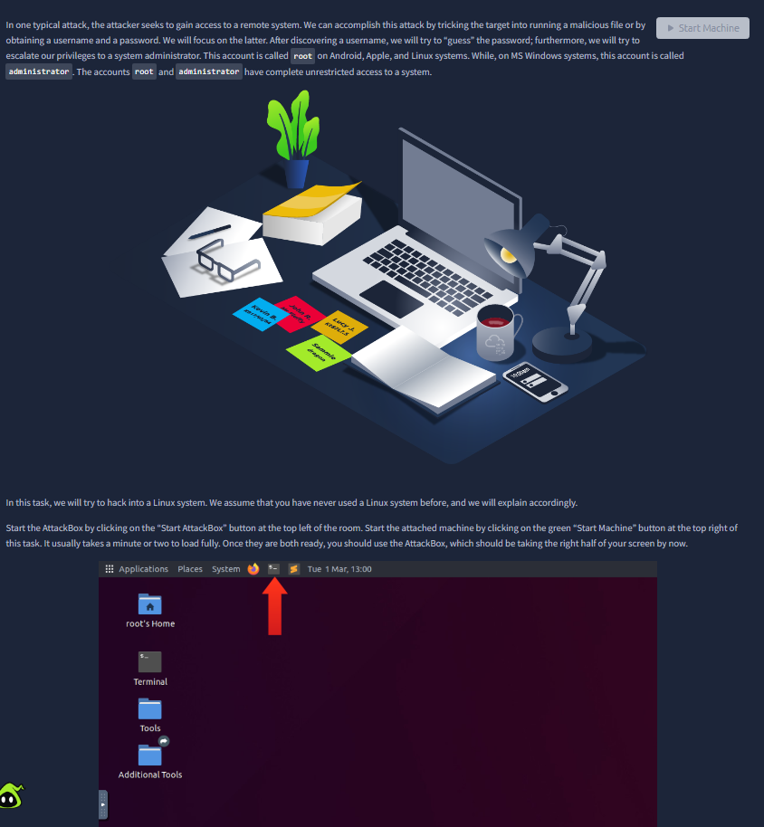

Here the room shifts from theory to offensive simulation. The scenario explicitly models a common chain:
1. obtain/guess user credentials,
2. log in remotely,
3. escalate privileges toward admin/root context.

This is realistic and pedagogically strong because most host compromises are sequences, not one-click events. The screen also prepares the learner for SSH-based interaction and account-context transitions.

---

### 9) Operational command toolkit for initial access and local verification
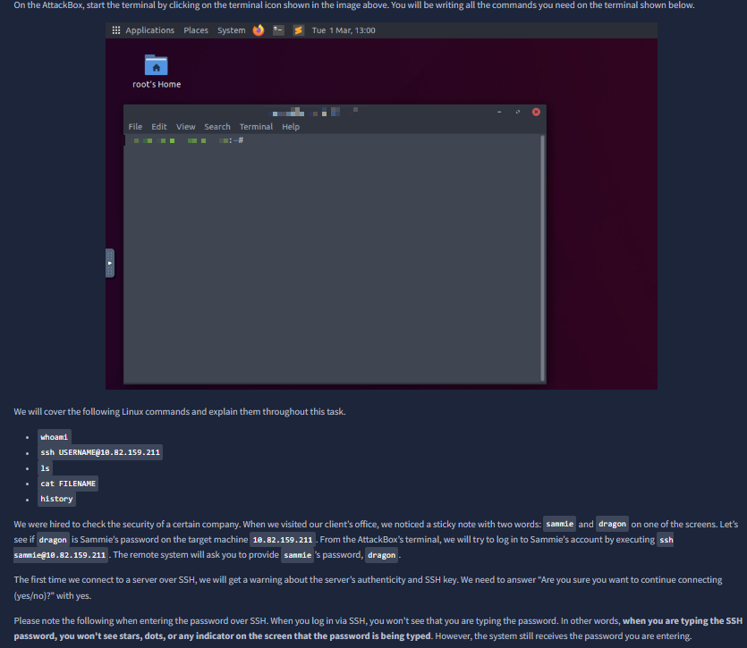

The screenshot documents the practical toolkit used in the task:
- `ssh` for remote access,
- `whoami` for identity confirmation,
- `ls` and `cat` for local artifact inspection,
- `history` for behavioral traces.

The note about invisible password entry during SSH is operationally important for beginners and reduces false troubleshooting (“nothing is typing”).

From a security process view, this screen teaches a reliable sequence after access: verify identity, enumerate artifacts, then inspect meaningful files.

---

### 10) Proof of compromise chain: login success + data access patterns
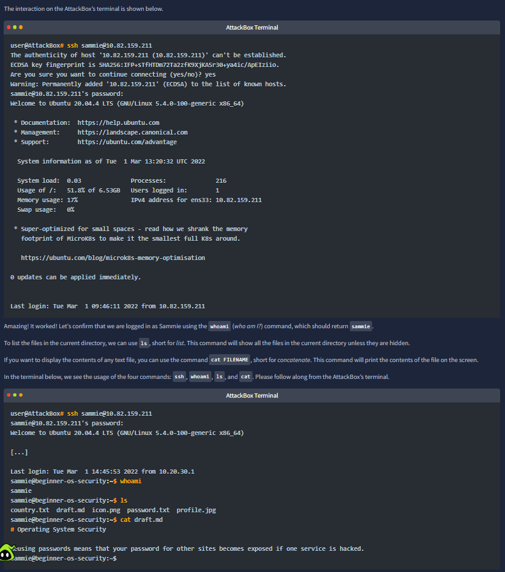

This evidence demonstrates successful remote login and immediate post-login validation. The command chain visible in terminal output shows how fast mismanaged credentials can become practical access.

Important learning points:
- successful authentication equals trust boundary crossing,
- low-friction enumeration (`ls`, `cat`) can quickly expose sensitive artifacts,
- simple mistakes (weak passwords, plaintext clues) compound into larger compromise paths.

This is exactly the kind of “small misconfig, big consequence” pattern seen in real incidents.

---

### 11) Final escalation-oriented Q&A + command-history intelligence
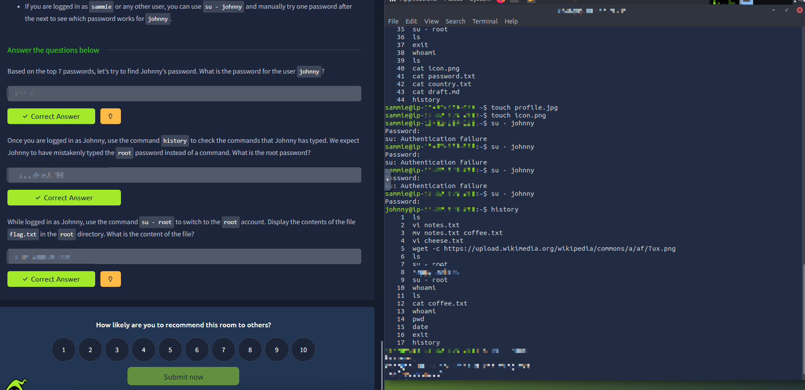

The last screenshot ties everything together with three practical techniques:
1. password guessing against another account (`su - <user>`),
2. mining command history for accidental secret disclosure,
3. pivoting to privileged account and extracting protected file content.

The right-side terminal history emphasizes a subtle but frequent real-world problem: users leak operational secrets into shell history (or notes/scripts), creating escalation opportunities for anyone with account foothold.

Final security message of the room:
- weak password practices + credential reuse + poor operational hygiene can collapse host security layers quickly,
- and once privilege escalation succeeds, confidentiality/integrity/availability risk expands system-wide.

## Key Takeaways
- OS security is a layered discipline: authentication strength, permission boundaries, and malware resistance all matter together.
- The CIA triad is practical: each weakness in this room maps to a concrete CIA failure mode.
- Command history, plaintext artifacts, and account misuse are major real-world escalation vectors.
- Host-level hardening is inseparable from AppSec because applications inherit platform trust and platform weaknesses.
