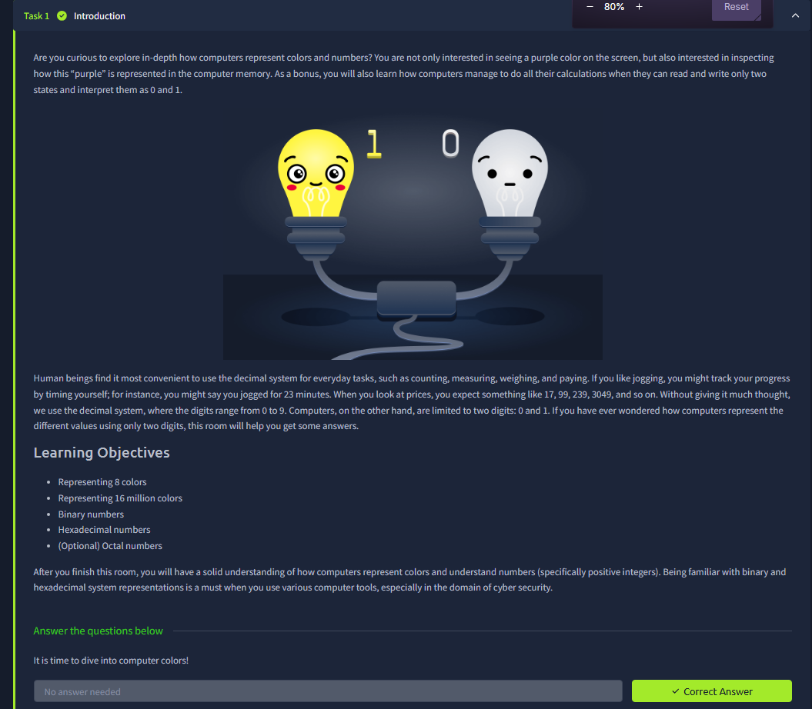
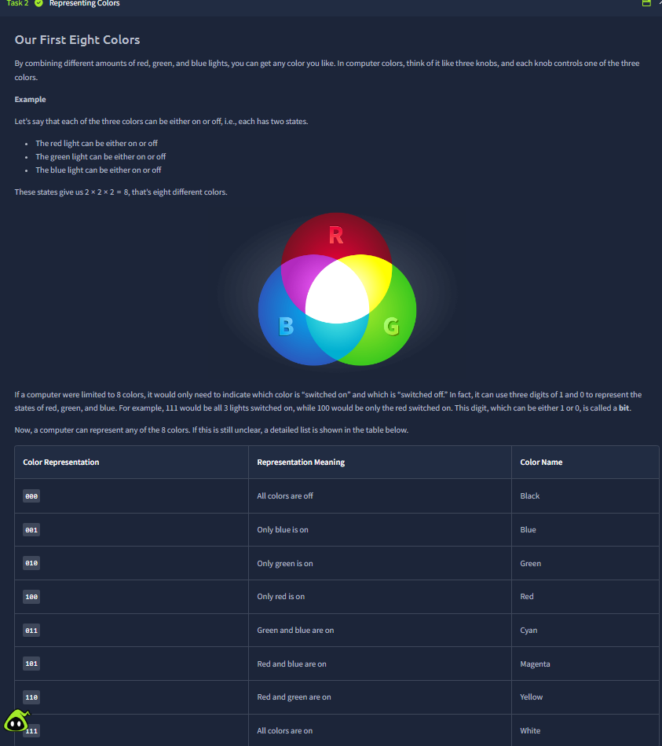
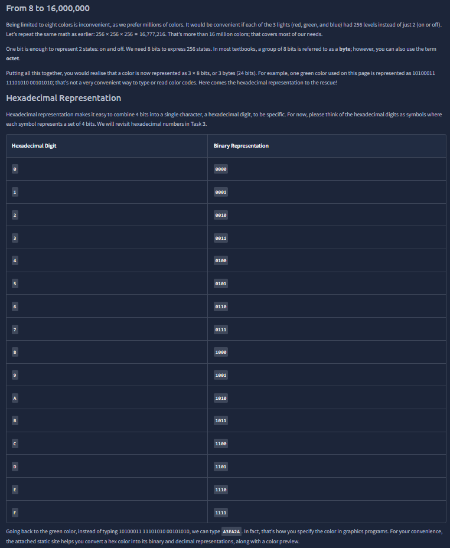
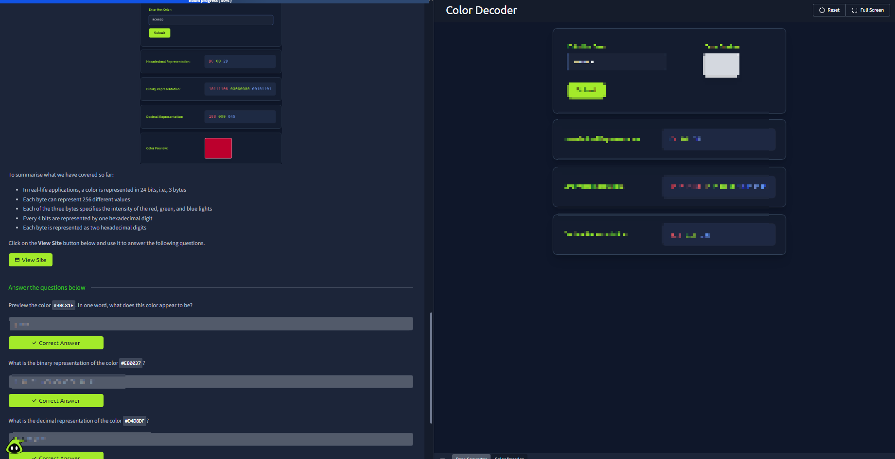
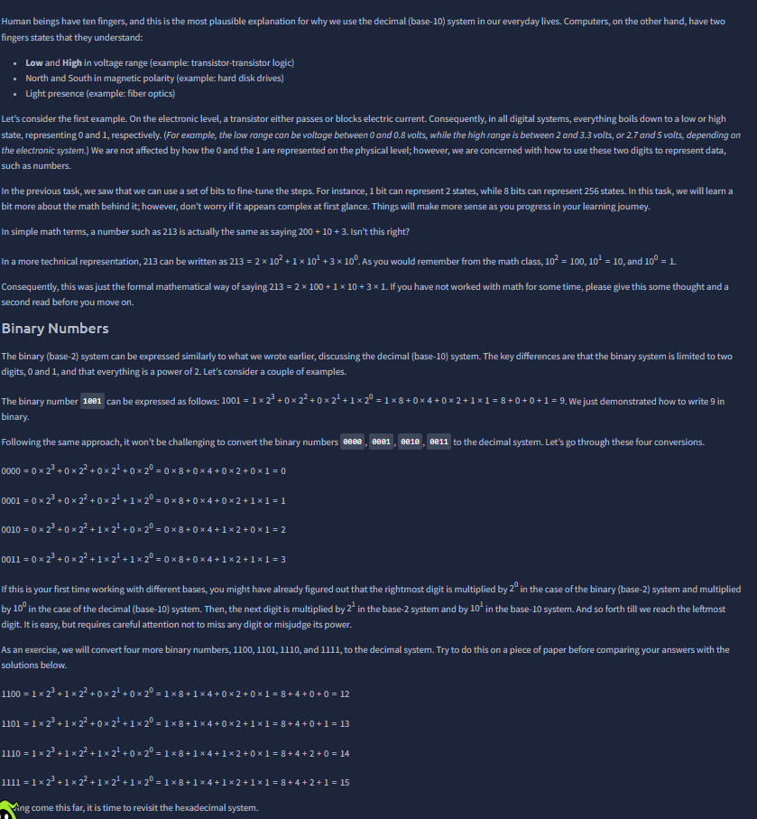
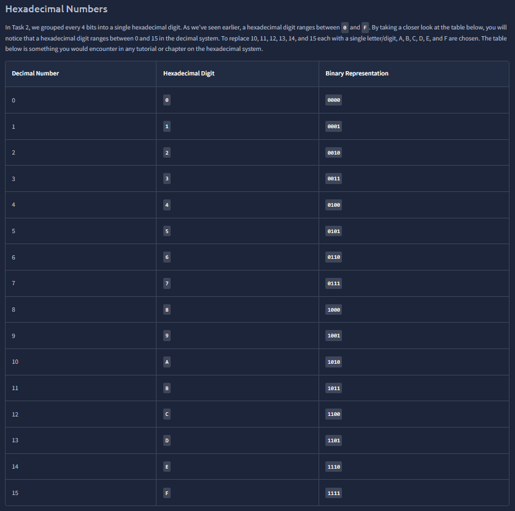
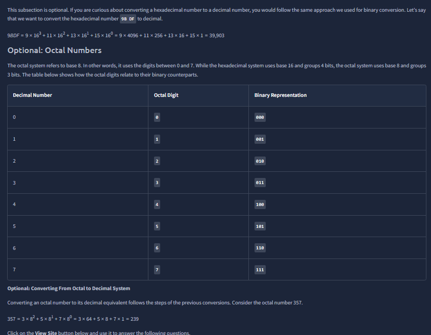
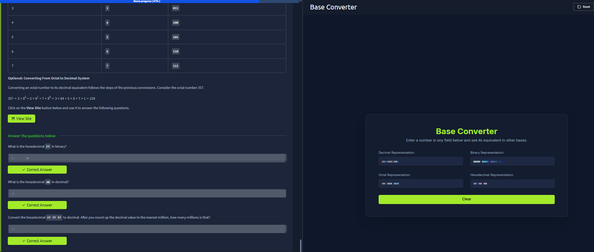

# Data Representation

Room link: https://tryhackme.com/room/datarepresentation

## Executive Summary
- This room explains how computers represent information (especially colors and numbers) by using bits and different number bases.
- The flow starts from binary logic (`0/1`), then scales up to practical color encoding (RGB + hexadecimal), and finally revisits base conversion math (binary/decimal/hex/octal).
- For security learners, this is foundational because packet analysis, memory values, encodings, and tooling output are constantly shown in non-decimal forms.

## Walkthrough (Evidence + Analysis)

### 1) Room setup: from human decimal intuition to machine binary logic

The first screenshot frames the core mismatch: humans naturally think in base-10, while digital systems internally work with two electrical states that map to `0` and `1`. The room also sets clear objectives (8-color model, 16M colors, binary, hex, optional octal), which is a strong learning sequence because each objective builds on the previous one.

Practically, this opening matters for AppSec because many low-level artifacts (logs, protocol fields, hashes/fragments, memory-like values) appear in non-decimal formats. If base conversion is weak, analysis speed drops and mistakes increase.

---

### 2) RGB with three on/off channels: why 2 × 2 × 2 = 8 colors

This screenshot introduces the cleanest color model possible: each channel (`R`, `G`, `B`) is either off or on. That produces 3 bits total, giving `2^3 = 8` combinations. The table then maps bit patterns (`000` to `111`) to real color names, which makes the concept concrete instead of abstract.

The important conceptual jump here is that **bits are not only “numbers”** — they can represent state selections. In security work, the same idea appears in flags/bitmasks in headers and permissions.

---

### 3) Scaling to real-world color depth: 24-bit RGB and hex compression

Here the room scales from 8 colors to practical displays: each RGB channel gets 8 bits (0–255), so total depth becomes 24 bits (3 bytes), enabling ~16.7 million combinations. It then introduces hexadecimal as a compact notation where each hex digit corresponds to 4 bits.

This is exactly why `#RRGGBB` is practical:
- binary is accurate but verbose,
- hex preserves precision while staying readable/editable.

This screenshot also reinforces the `0–F` hex table, which is heavily reused in debugging and security tooling.

---

### 4) Interactive color decoder: cross-checking hex, binary, decimal, and visual output

This evidence shows a strong practical checkpoint: one input color value is reflected simultaneously in:
- hexadecimal representation,
- binary representation,
- decimal representation,
- and a visual color preview.

The educational value is high because it verifies equivalence across representations, not just memorization. You can immediately see that if one representation is wrong, the preview/output also shifts, which gives fast feedback.

---

### 5) Binary numbers from physical states to arithmetic expansion

This screenshot transitions from color encoding to numeric systems and explains binary mathematically through powers of two. It also connects digital states to physical/electrical behavior, which is an important “why” behind binary, not just a rule to memorize.

The room’s expansion examples (`1001`, `1100`, etc.) are essential because they train a repeatable method:
1. assign positional weights (`2^n`),
2. multiply by each bit,
3. sum results.

This method is directly reusable when reading subnet masks, protocol fields, or permission-style bit values.

---

### 6) Hexadecimal table as a compact binary index

This table is the practical bridge most analysts rely on daily: a 4-bit nibble maps to one hex digit. By keeping this mapping fluent (`A=10`, `F=15`, etc.), conversions become much faster and less error-prone.

In security operations, this is constantly useful for:
- interpreting bytes from traffic dumps,
- reading encoded identifiers,
- validating tool outputs that default to hex notation.

---

### 7) Optional octal introduction: grouping bits in threes

This screenshot introduces octal as base-8 and explains the grouping logic (3 bits per octal digit). While octal is less common than hex in modern web-focused workflows, the comparison sharpens number-base intuition and helps prevent confusion when alternate notation appears in tooling or legacy contexts.

The section also keeps conversion discipline consistent with previous tasks, which reinforces transferable problem-solving rather than one-off formulas.

---

### 8) Base converter practical: applying conversions under mixed-base questions

The final practical combines all prior concepts in one interface and asks conversion questions across hex, binary, decimal, and octal outputs. This is a strong closing format because it measures whether the learner can move between representations fluidly, not just recognize isolated patterns.

From an AppSec perspective, this is the main outcome of the room: when a value is shown in an unfamiliar base, you can still normalize it, reason about it, and continue analysis confidently.

## Key Takeaways
- Bits are generalized state containers; numbers and colors are both special cases of bit-level representation.
- RGB color in modern interfaces is typically 24-bit (`8 bits × 3 channels`) and commonly written in hexadecimal form.
- Hex works as a compact binary representation (`1 hex digit = 4 bits`), which is why it is dominant in low-level tooling.
- Base conversion fluency is a practical security skill, not just theory: it improves speed and accuracy in debugging and investigation.
