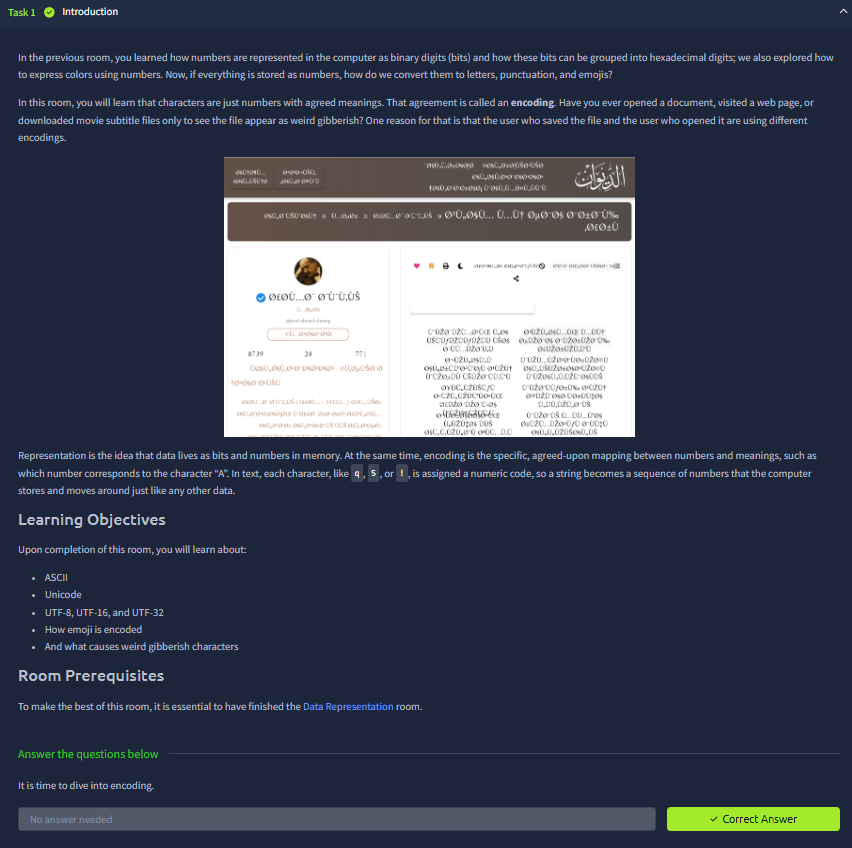
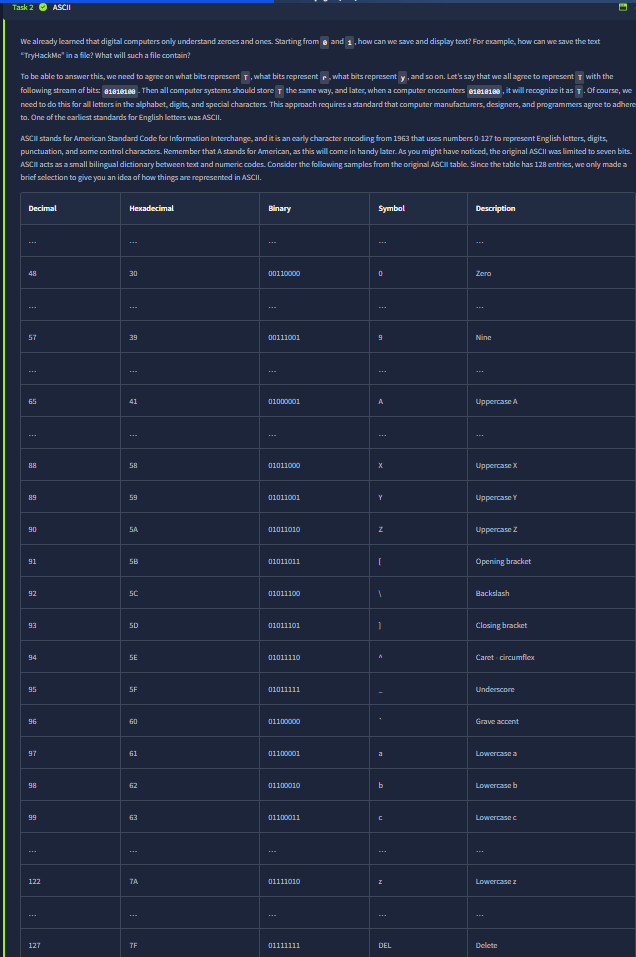
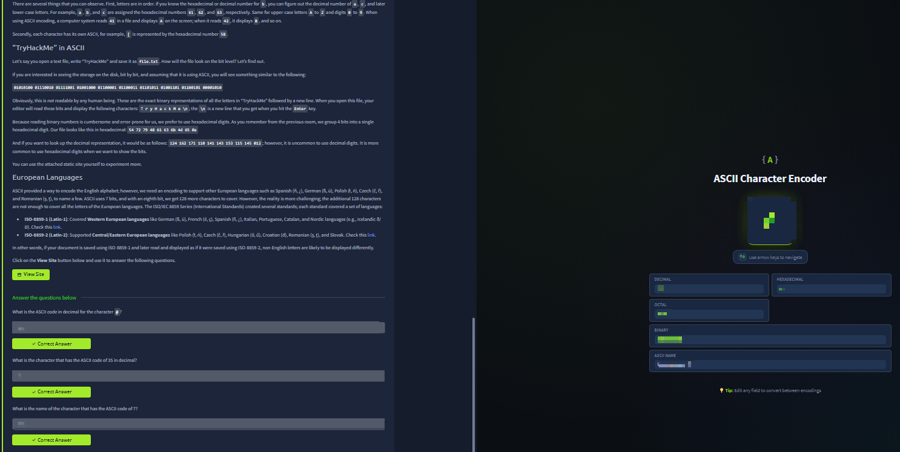
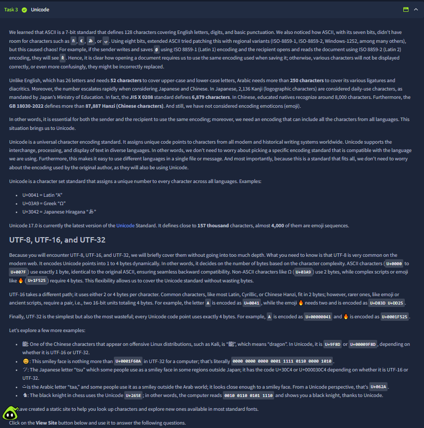
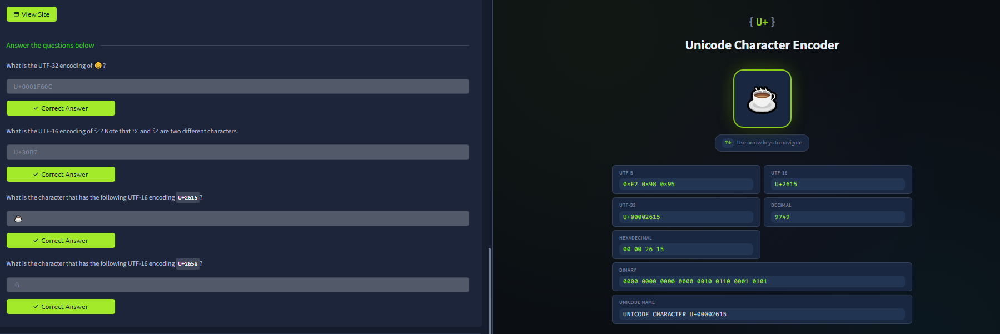

# Data Encoding

Room link: https://tryhackme.com/room/dataencoding

## Executive Summary
- This room explains how text is represented as numbers, why different encodings exist, and why encoding mismatch causes unreadable “gibberish”.
- The progression is practical: ASCII basics, extended regional standards, Unicode as a universal model, then UTF-8/UTF-16/UTF-32 differences.
- For security work, this is fundamental because logs, payloads, source files, and APIs can break or be misinterpreted when encoding assumptions are wrong.

## Walkthrough (Evidence + Analysis)

### 1) Introduction: representation vs encoding

The first screenshot sets the most important distinction: **representation** is how data exists in memory (bits/numbers), while **encoding** is the shared mapping between numbers and human-readable symbols. This is exactly why two systems can store bytes correctly but still display nonsense if they decode with different standards.

The room objectives shown here are well structured:
- ASCII origins,
- Unicode expansion,
- UTF family behavior,
- and real-world mismatch symptoms.

That order is useful because it starts with historical limitation and ends with modern interoperability.

---

### 2) ASCII practical + extended encodings for European scripts

This screen combines theory and lab practice effectively. Left side explains classic ASCII mechanics (character-to-number mapping); right side provides a converter to verify values in decimal/hex/octal/binary and symbolic form.

The most important insight in this section is that “ASCII alone” is not enough for many languages. The ISO-8859 examples show why regional extensions appeared: once text includes accented characters, plain 7-bit assumptions fail.

Security relevance:
- input validation and storage pipelines often assume one encoding,
- but user data may arrive in another.
- That mismatch can break parsing, filtering, and audit trails.

---

### 3) ASCII table as deterministic lookup model

This screenshot gives a structured lookup table (decimal, hex, binary, symbol, description), making it clear that encoding is deterministic, not “best guess.” A single symbol always maps to a precise numeric code under a defined standard.

Practically, this helps in debugging suspicious text artifacts:
- if one byte sequence renders unexpectedly,
- verify the expected standard first,
- then verify the observed numeric mapping.

This discipline is essential in incident analysis and forensic timelines where exact character values matter.

---

### 4) Unicode + UTF-8/16/32: one character set, multiple transfer forms

This is the conceptual core of the room. It explains why Unicode exists (single global character set) and how UTF encodings store those code points differently:
- UTF-8: variable length, web default, backward-friendly with ASCII,
- UTF-16: 2-byte units, with surrogate pairs for larger ranges,
- UTF-32: fixed width, simpler indexing but larger storage cost.

The multilingual examples reinforce why Unicode is mandatory for modern systems: one app may need Latin, Greek, Arabic, CJK, and emoji in the same workflow.

From AppSec perspective, this section is critical for avoiding edge-case bugs in normalization, filtering, and display logic.

---

### 5) Unicode practical: verifying code points across formats

The final screenshot shows a practical Unicode encoder where one character is exposed simultaneously as UTF-8 bytes, UTF-16/UTF-32 values, decimal, hex, binary, and official Unicode naming. This is exactly the kind of tool-assisted verification used when application behavior differs between environments.

The Q&A on the left demonstrates confident cross-format translation:
- code point ↔ symbol,
- UTF representation ↔ readable character.

Final takeaway of the room:
- encoding problems are rarely random;
- they are usually deterministic mismatches that can be diagnosed by checking the exact standard and byte sequence.

## Key Takeaways
- Encoding is a contract; sender and receiver must agree on the same contract.
- ASCII is foundational but limited; Unicode solves global character coverage.
- UTF-8/16/32 encode the same Unicode character set with different storage trade-offs.
- Encoding awareness is a practical AppSec skill for reliable logging, parsing, input handling, and investigation quality.
