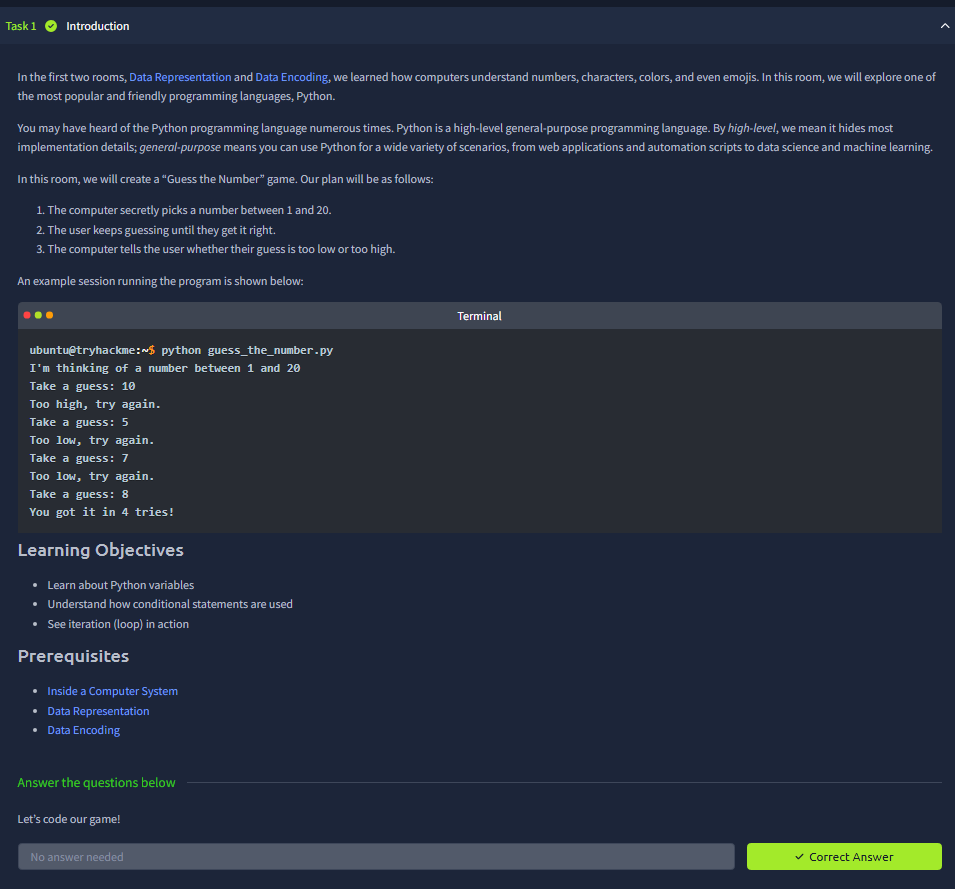
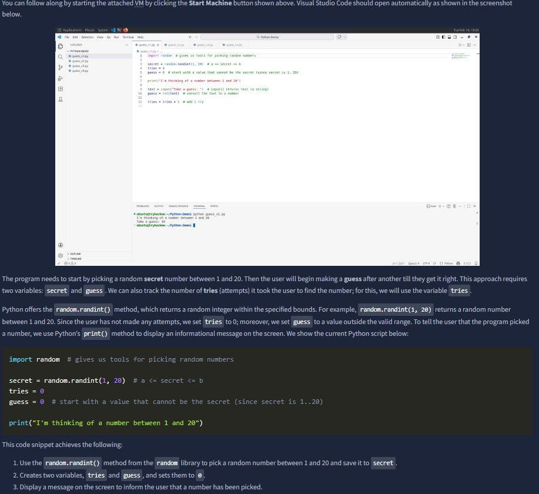
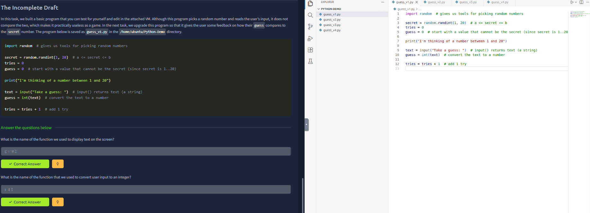
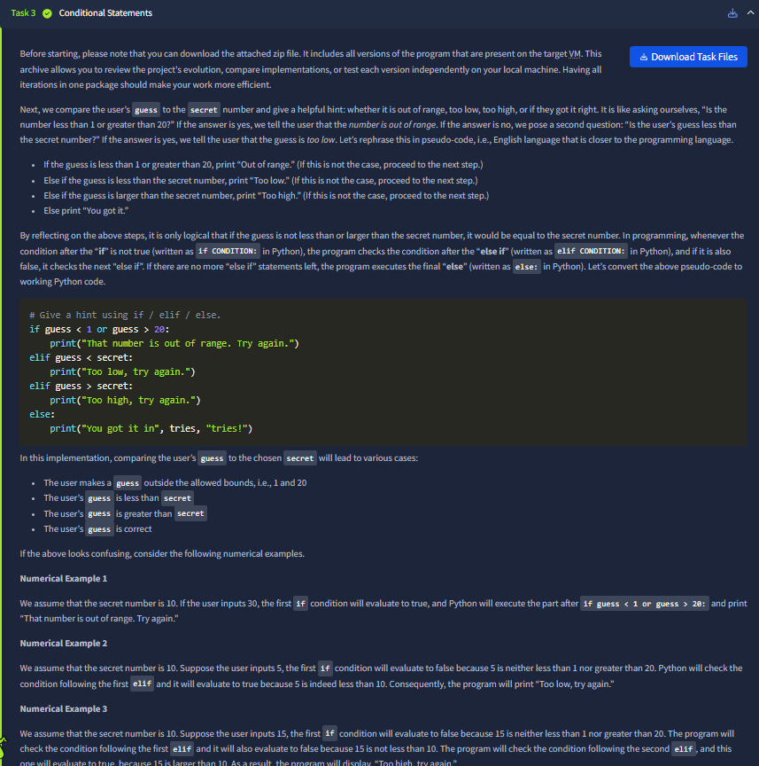
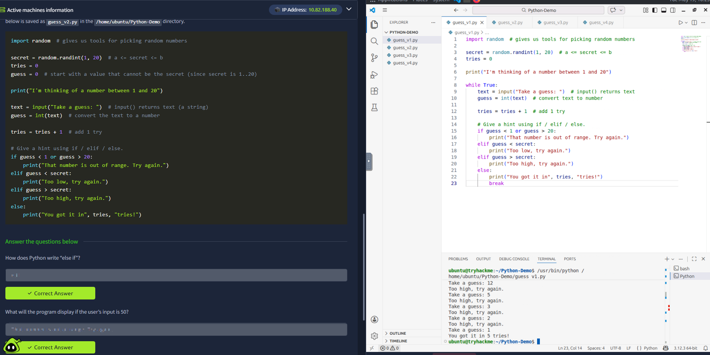
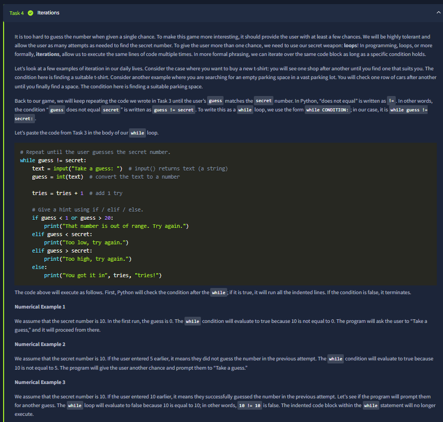
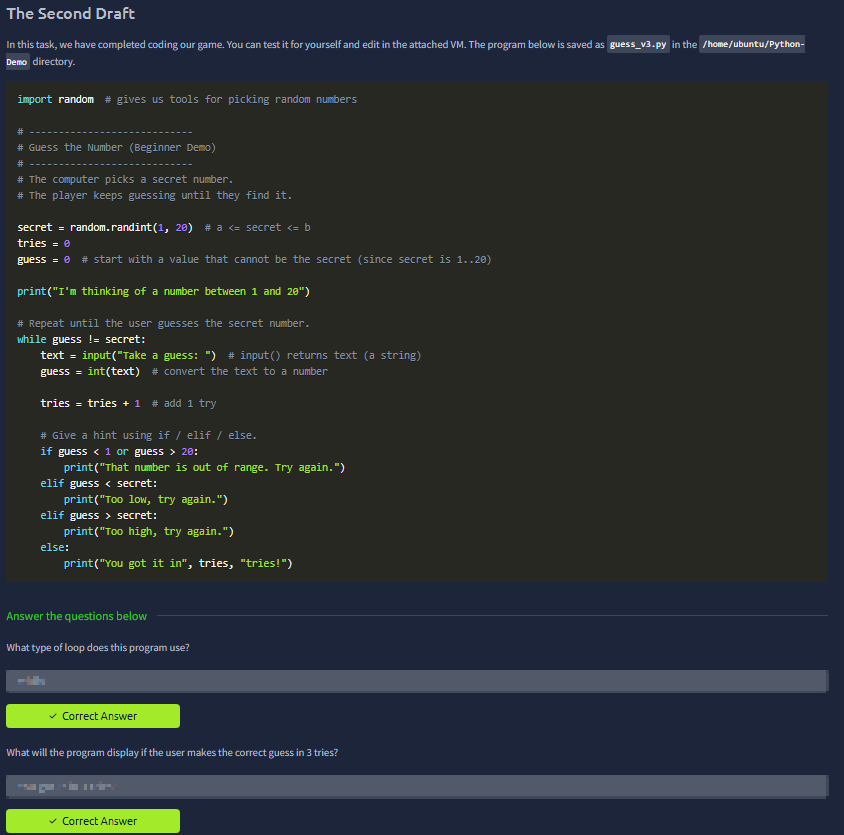



# Python Simple Demo

Room link: https://tryhackme.com/room/pythonsimpledemo

## Executive Summary
- This room gives a first practical look at Python syntax and execution flow with simple, visible examples.
- It focuses on core beginner concepts: output, variables, input handling, arithmetic/logic, and basic control flow.
- For security learners, this is valuable because scripting is essential for quick automation, parsing, and reproducible testing.

## Walkthrough (Evidence + Analysis)

### 1) Introduction and Python's role in practical security learning

The first screenshot frames Python as a "do something quickly" language rather than only an academic topic. That framing is important for AppSec: small scripts save major time in repetitive tasks like request formatting, payload generation, and output parsing.

This section also establishes the workflow expectation: write short code, run it, observe immediate results, then iterate.

---

### 2) First code execution: print output and syntax discipline

This screen demonstrates the first checkpoint every learner needs: can you run a script and get deterministic output. Even simple `print()` usage teaches syntax precision (parentheses, quotes, exact spelling) and helps build debugging habits early.

The key point is not complexity; it is correctness and repeatability.

---

### 3) Variables and data assignment

Here the room transitions from static text to stateful code. Variables hold values that can be reused and transformed, which is the foundation for all practical automation.

For security workflows, this pattern appears everywhere:
- store targets/paths,
- store decoded values,
- track counters/conditions during tests.

Understanding assignment clearly reduces logical mistakes later in larger scripts.

---

### 4) Input handling and user-driven behavior

This screenshot introduces input flow, where program behavior changes according to user-provided values. Conceptually this is critical because most real systems are input-driven.

Security relevance is direct:
- all external input must be treated carefully,
- parsing and validation become first-class responsibilities.

Even in a simple demo, learning how input enters logic prepares the ground for secure coding habits.

---

### 5) Operators and expression logic

This section shows how values are combined and compared. Arithmetic and logical expressions are the decision engine of scripts, and they define how conditions are interpreted.

In practice, this skill is used to:
- filter meaningful results,
- detect thresholds/patterns,
- make scripts branch safely based on observed data.

Clear operator understanding prevents subtle automation bugs.

---

### 6) Control flow: conditional branching

Conditional blocks (`if/else` style logic) are where scripts begin to "reason" about outcomes. This screenshot typically marks the jump from linear scripts to decision-based behavior.

For AppSec use cases, this enables:
- classify responses,
- choose next test step automatically,
- stop/continue execution based on evidence.

This is a core building block for reliable tooling.

---

### 7) Final practical checkpoint and concept consolidation

The final screenshot confirms that core Python primitives were understood as a complete mini-pipeline: input -> process -> output. At this point, the learner can already create simple scripts that reduce manual effort in routine technical tasks.

This is exactly the outcome we want before moving to larger automation tasks in networking/web-security contexts.

## Key Takeaways
- Python is immediately useful for small, repeatable security tasks.
- Syntax discipline + quick feedback loops create strong debugging habits.
- Variables, input, operators, and conditionals form the minimum practical scripting toolkit.
- Even basic scripting skills significantly improve analysis speed and consistency.
