

# JavaScript Simple Demo

Room link: https://tryhackme.com/room/javascriptsimpledemo

## Executive Summary
- This room moves from static markup into client-side logic and interaction.
- Main focus is understanding how JavaScript reads page elements, reacts to user actions, and updates visible output.
- For AppSec foundations, this is key because many client-side issues (DOM injection, insecure logic, exposed data paths) start exactly here.

## Walkthrough (Evidence + Analysis)

### 1) Room scope and JS mindset shift
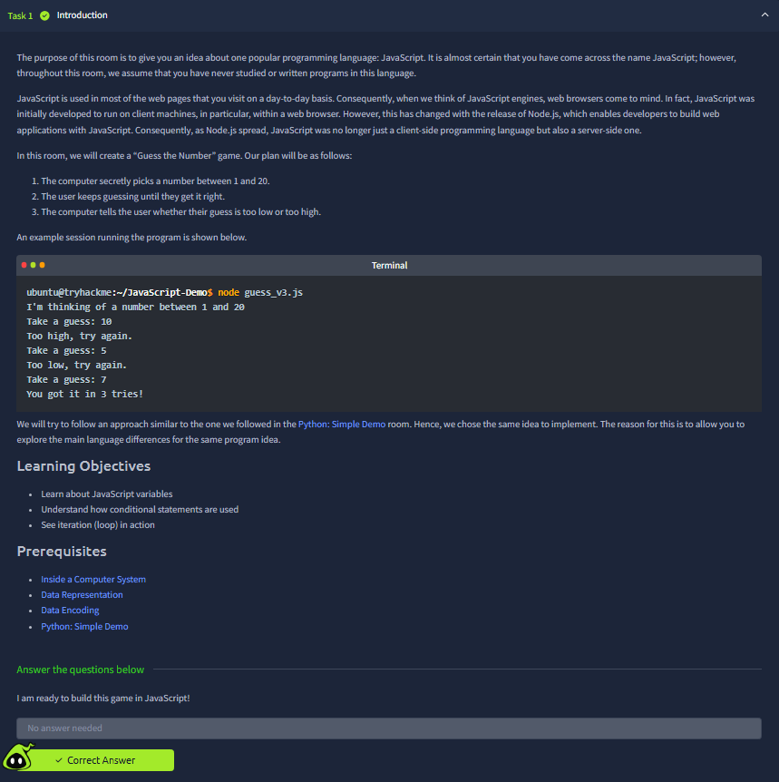
This first screen introduces the core shift from "display-only" pages to behavior-driven pages. The important concept is that JavaScript controls how front-end reacts after the page loads.

### 2) JavaScript execution in browser context
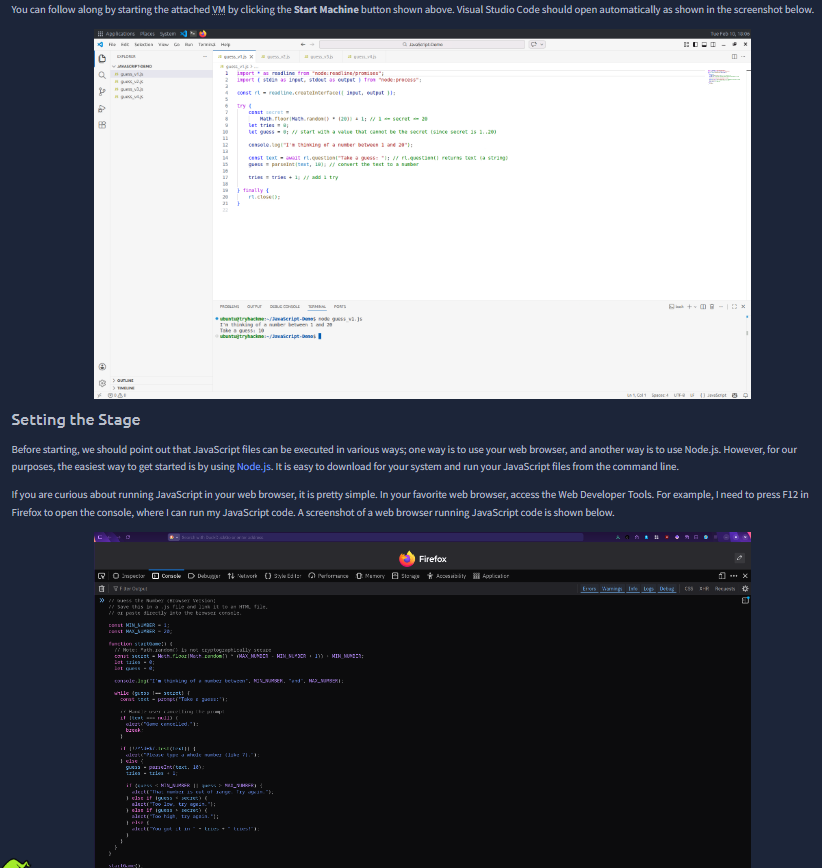
Here we see JS being executed by the browser runtime. This matters for security because code execution happens on user-controlled clients, so assumptions about trust must stay server-side.

### 3) Variables and dynamic values
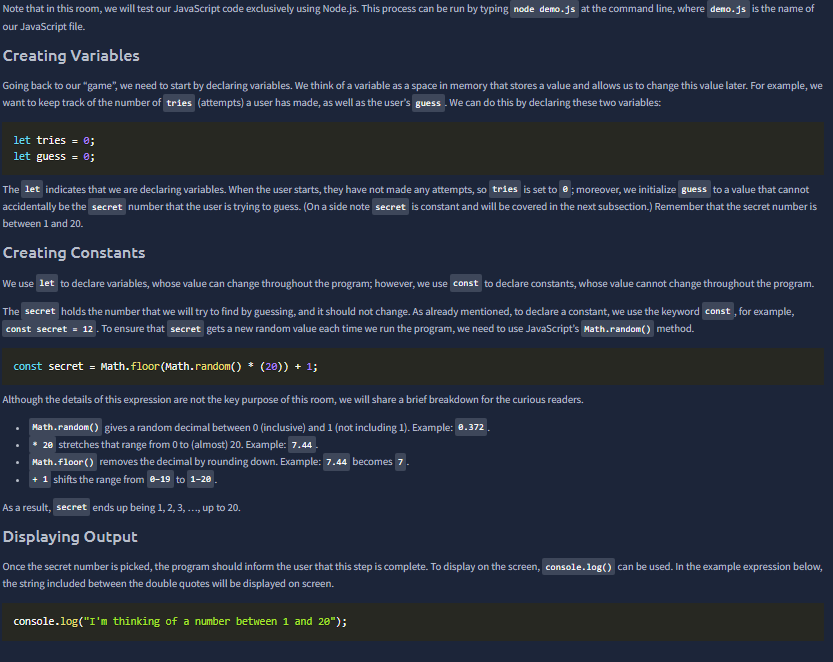
This section shows variable assignment and reuse. In practical terms, user data gets stored, transformed, and reused in page logic, which is where validation mistakes can propagate quickly.

### 4) Functions and reusable behavior
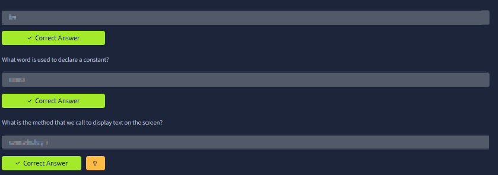
Functions package repeated logic into reusable blocks. The screenshot highlights that frontend workflows are typically function-driven (read input -> process -> render), which is the same flow many injection flaws abuse.

### 5) Reading input from DOM elements
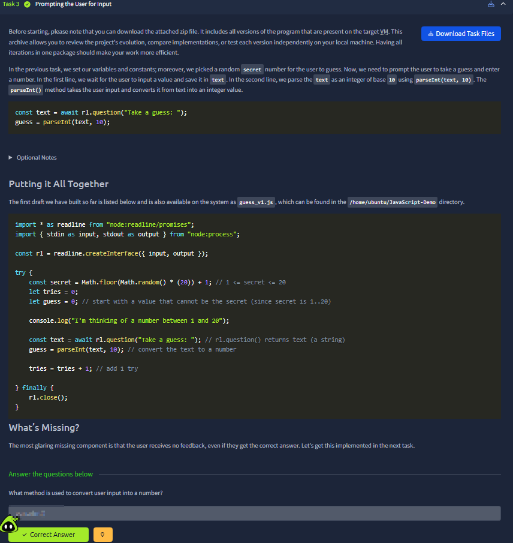
This is a critical step: pulling raw user input from form fields. From an AppSec lens, this is the moment attacker-controlled data enters app logic.

### 6) Writing output back to the page
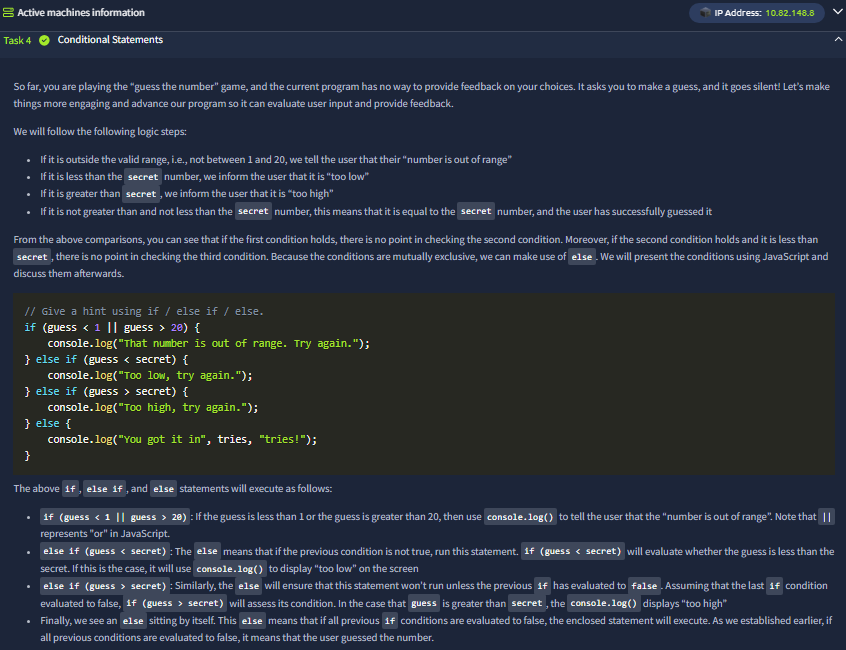
Now the script writes processed data into visible HTML. If output encoding/sanitization is missing, this exact stage can become DOM-based injection territory.

### 7) Event-driven behavior (click/action flow)
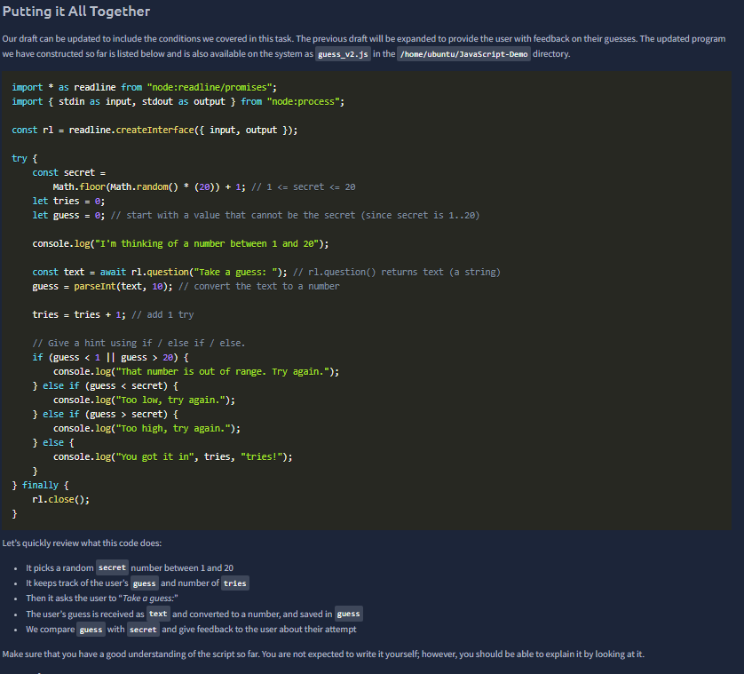
The screenshot demonstrates event-based execution (`onclick`/button trigger). This models real web apps where business actions are often initiated via DOM events.

### 8) Logic chaining: input -> function -> result
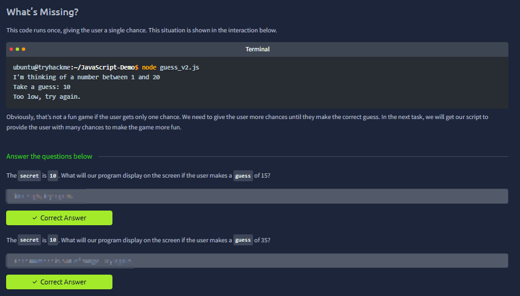
This part connects previous pieces into a full mini flow. It reinforces that front-end is not just styling; it is a data pipeline that must be handled safely.

### 9) Practical interactive mini-lab
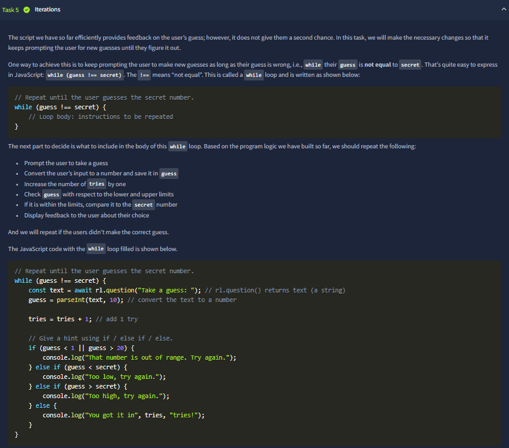
The practical section validates whether the code actually behaves as expected in runtime, not just syntactically. This execution-first habit is essential for both debugging and security testing.

### 10) Question checks and concept validation
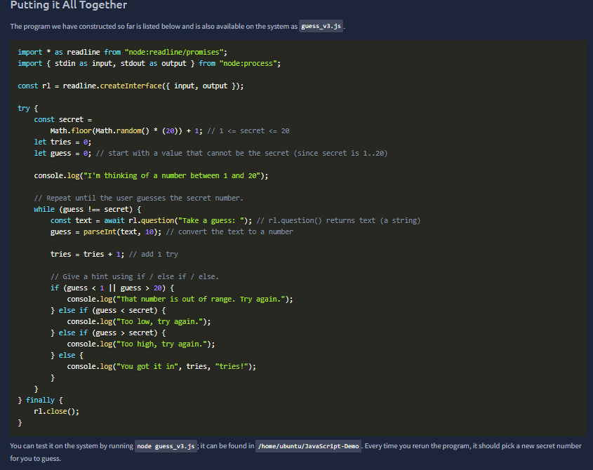
The checkpoint confirms understanding of JS fundamentals (logic, syntax, execution order). For portfolio progression, this is the baseline before deeper web-security modules.

### 11) Final completion and consolidation
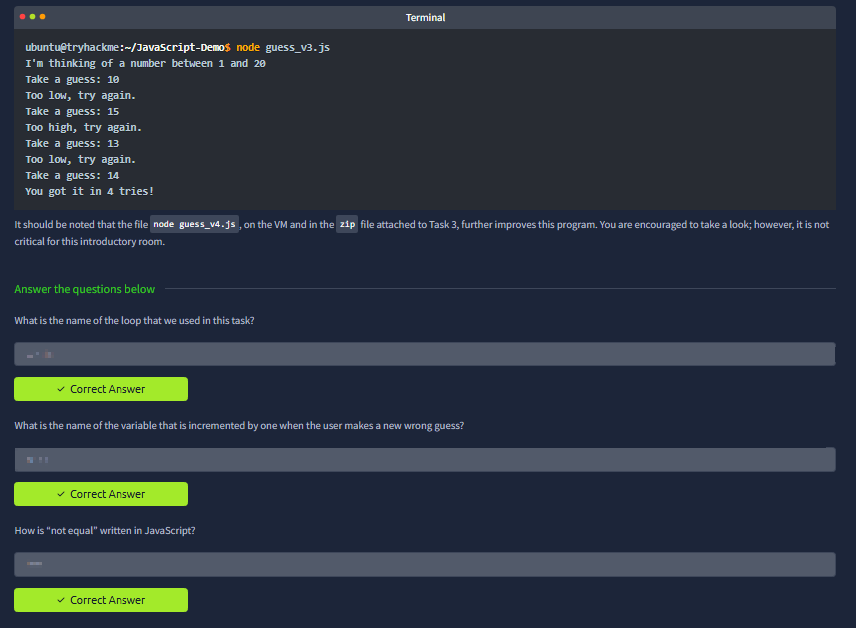
Final screen shows successful completion and concept consolidation. At this stage, you can reason about how user input becomes DOM output — a direct prerequisite for understanding XSS/DOM security rooms later.

## Key Takeaways
- JavaScript introduces state, behavior, and event-driven UI updates in the browser.
- Every client input path must be treated as untrusted before rendering.
- DOM read/write flows are foundational for later AppSec topics, especially XSS and client-side logic flaws.
- Building and testing small interactive scripts improves both coding confidence and vulnerability intuition.
