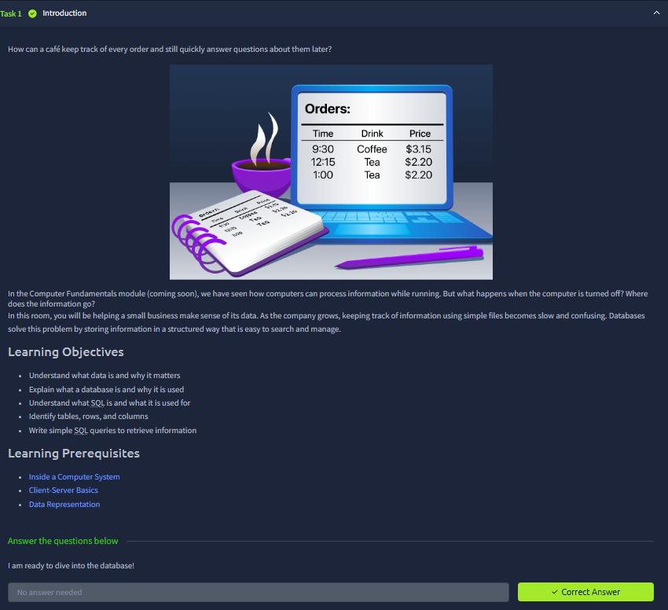
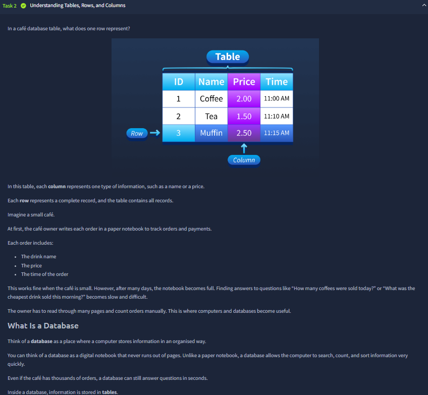
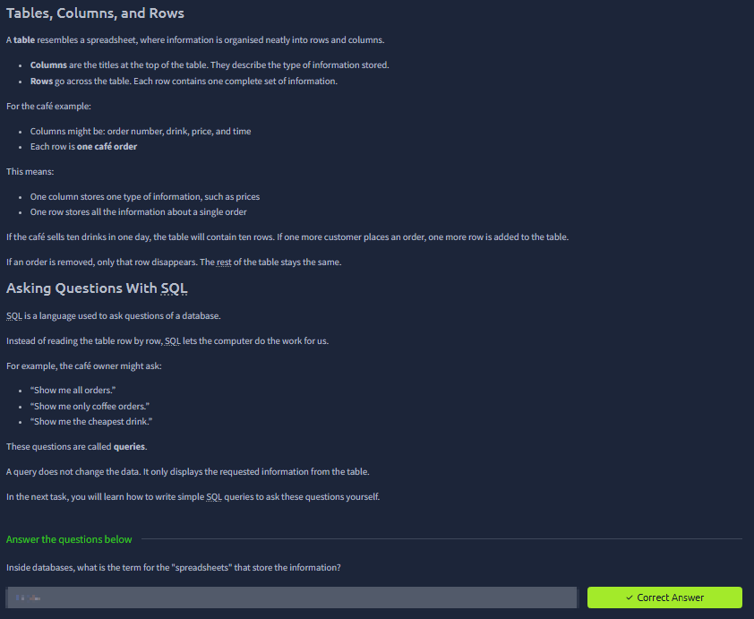
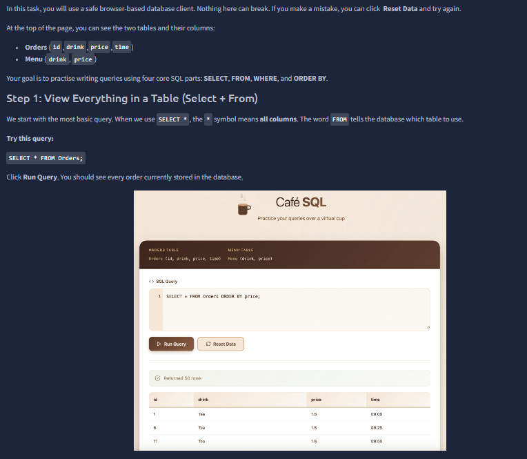
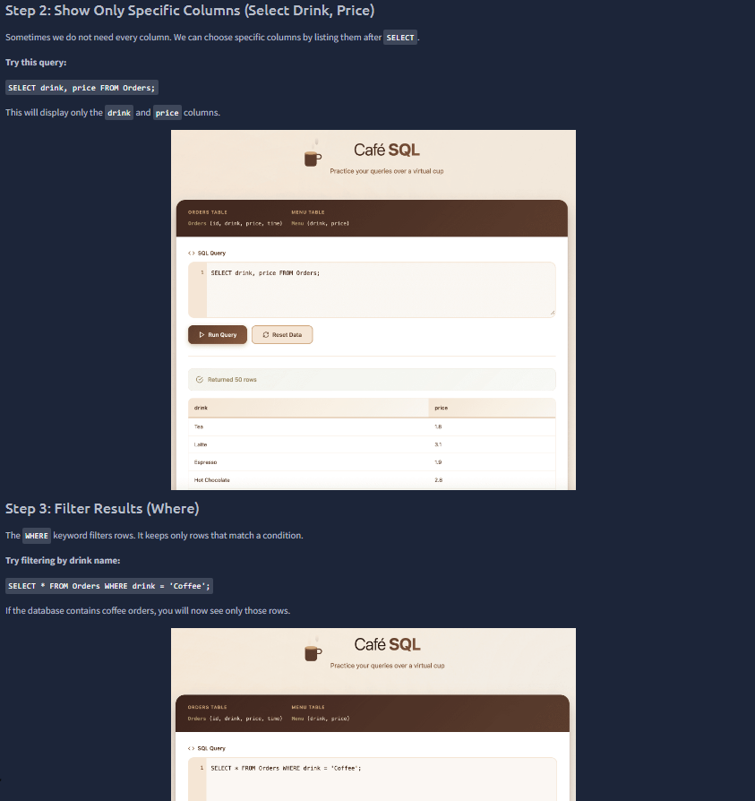
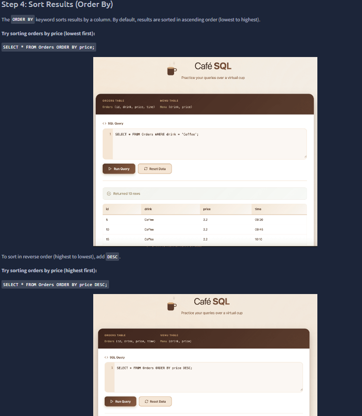
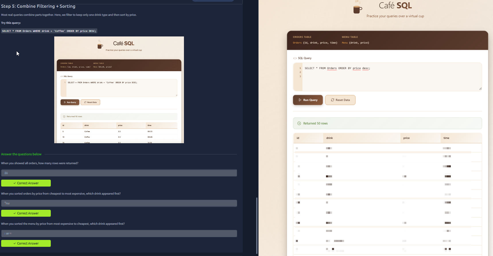



# Database SQL Basics

Room link: https://tryhackme.com/room/databasesqlbasics

## Executive Summary
- This room introduces relational database fundamentals and core SQL query patterns.
- It focuses on practical reading/writing operations: selecting data, filtering rows, and understanding table structure.
- For AppSec, this room is foundational because injection risks are directly tied to how apps build and execute SQL queries.

## Walkthrough (Evidence + Analysis)

### 1) Database concept introduction and why SQL matters

The first screenshot sets the context: applications store structured information in databases, and SQL is the language used to retrieve and manipulate that information. This creates the exact data boundary AppSec engineers care about: user input from the app layer eventually becomes database queries.

### 2) Tables, rows, and columns model

This section explains the relational structure clearly: tables represent entities, rows represent individual records, and columns represent attributes. Understanding this model is critical because attack impact is usually measured per table/row scope (what data can be read, altered, or deleted).

### 3) Basic query flow with SELECT statements

Here we move into `SELECT` usage, which is the primary read operation. The main lesson is query precision: selecting only needed fields and understanding result sets. In security terms, sloppy query construction increases unnecessary exposure and expands potential leakage surfaces.

### 4) Filtering and condition logic (WHERE usage)

The screenshot highlights condition-based retrieval with `WHERE`. This is one of the most security-relevant parts of beginner SQL, because user-provided filters are commonly mapped into this clause. If validation and parameterization are missing, this exact query area becomes SQL injection territory.

### 5) Practical SQL interaction and output interpretation

This practical section demonstrates actual command execution and result interpretation. It reinforces operational habits: run query, inspect returned rows, verify assumptions, then iterate. These habits are essential later when reproducing vulnerabilities or validating fixes.

### 6) Question checkpoints and concept verification

The checkpoint confirms understanding of command intent, syntax structure, and data interpretation. This stage ensures the learner can map SQL keywords to behavior rather than memorizing commands mechanically.

### 7) Final consolidation of SQL basics

Final evidence shows completion and consolidation of core relational/SQL thinking. At this point, the learner has the minimum baseline needed to progress into web-input to SQL execution paths, which directly supports upcoming AppSec-focused labs.

## Key Takeaways
- SQL basics are not just database skills; they are direct prerequisites for understanding injection risk.
- Table/row/column thinking helps reason about attack impact and data exposure scope.
- `SELECT` + `WHERE` are central to both normal app behavior and many SQLi exploitation paths.
- Hands-on query execution builds the debugging discipline needed for secure testing and remediation.
