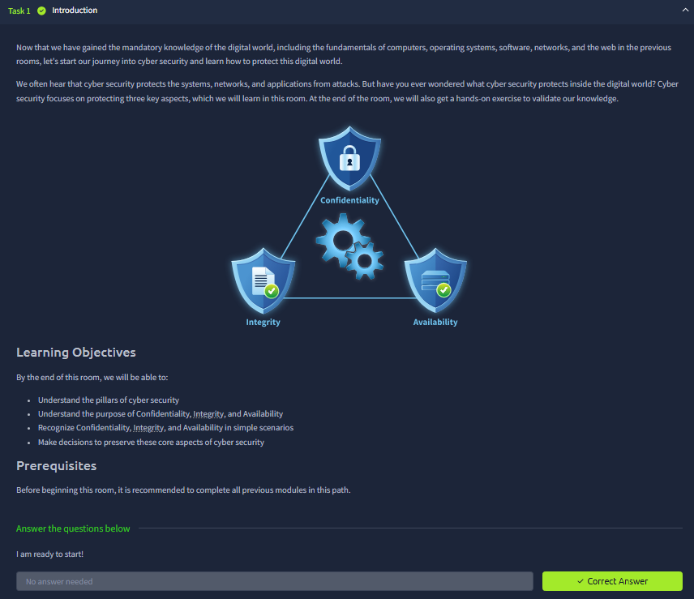
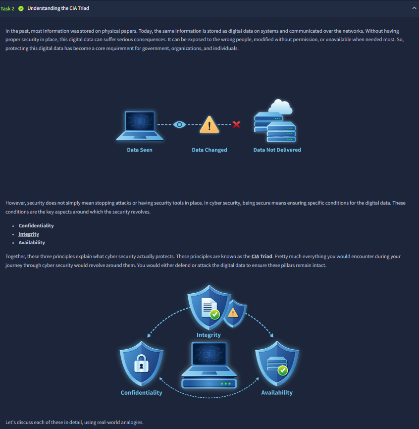
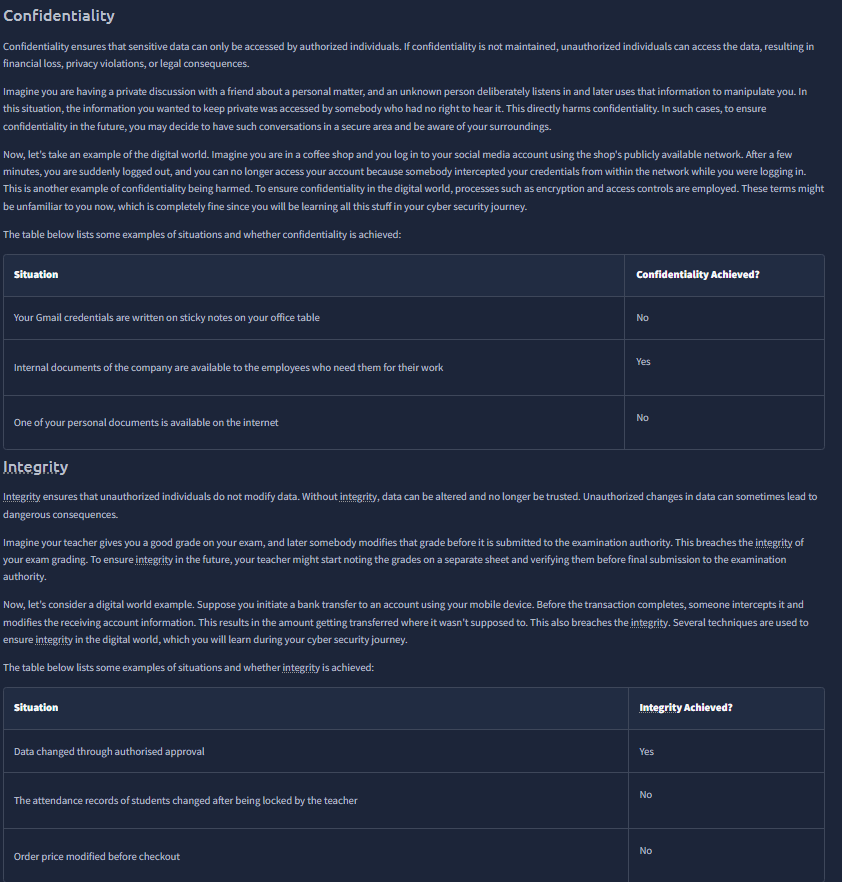
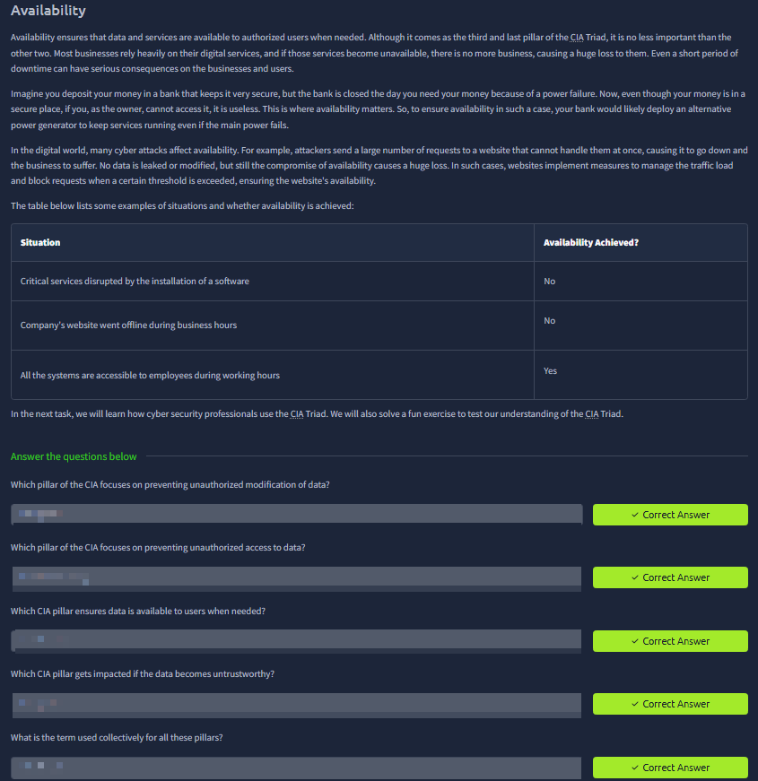
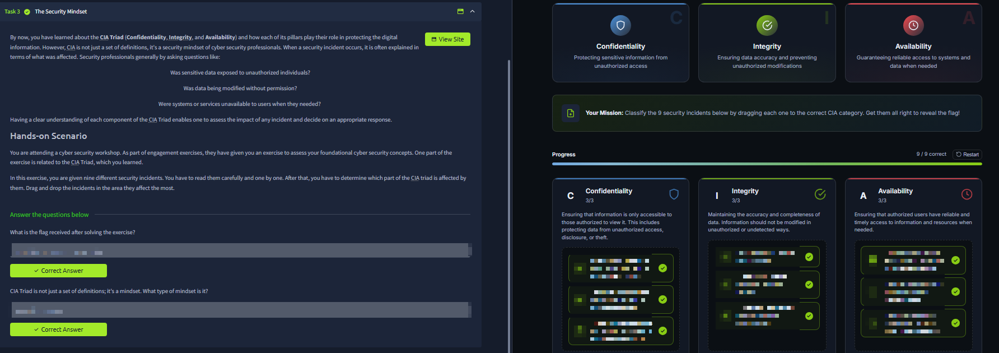



# The CIA Triad

Room link: https://tryhackme.com/room/theciatriad

## Executive Summary
- This room explains what cybersecurity protects through the CIA Triad: Confidentiality, Integrity, and Availability.
- It uses realistic examples (credentials, transactions, service outages) to show that security is not only blocking attackers, but preserving data trust and service continuity.
- It finishes with a scenario-based exercise to train incident thinking by classifying events under the right pillar.

## Walkthrough (Evidence + Analysis)

### 1) Introduction: the three pillars are learned together

The first screenshot introduces the room with a triangle diagram where all three pillars appear together: Confidentiality at the top, Integrity on the left, and Availability on the right. The layout itself already teaches an important message: these are interdependent controls, not isolated topics.

The learning objectives shown below the diagram are also clear: understand each pillar’s purpose and apply them in practical scenarios. This means the room is oriented toward decision-making, not memorization.

### 2) Why CIA exists: what can go wrong with digital data

This section expands the problem statement with three failure outcomes shown visually: data seen by the wrong party, data changed, and data not delivered. These map directly to confidentiality breach, integrity breach, and availability breach.

The screenshot then explicitly lists the three principles and shows a second triad-style graphic around a central system. That central placement is meaningful: CIA is used to evaluate the same system from three different protection angles.

### 3) Confidentiality and Integrity in practical examples

This image contains two full sections on one page:

- **Confidentiality block** explains unauthorized access risks with concrete examples (credentials exposure, personal/private information leaks, public posting of sensitive docs).
- **Integrity block** explains unauthorized modification risks with examples like altered records, modified prices, or changed transaction details.

The tables in the screenshot are especially useful because they force yes/no evaluation. That is the exact habit needed in AppSec triage: ask "was data exposed?" and "was data altered?" as separate checks.

### 4) Availability and quick pillar-identification checks

This section focuses on availability: systems and services must be accessible when needed. The examples shown (service disruption during business hours, inaccessible critical functions) anchor availability in operational impact rather than theory.

At the bottom, the question block asks you to map statements back to the right pillar. That checkpoint validates understanding across all three pillars and reinforces distinction:
- unauthorized modification -> Integrity,
- unauthorized access -> Confidentiality,
- service access when needed -> Availability.

### 5) Security mindset exercise: classify incidents by CIA impact

The final screenshot shows the hands-on scenario where incidents are classified into CIA categories on the right panel, with all categories completed correctly (9/9). This is the strongest part of the room because it translates theory into analyst-style incident reasoning.

It also introduces the idea that CIA is a mindset used during investigations: ask what was exposed, what was changed, and what became unavailable, then decide the response path from that classification.

## Key Takeaways
- CIA Triad is an incident analysis framework, not just a definition set.
- Confidentiality protects against unauthorized viewing, Integrity against unauthorized modification, Availability against downtime or inaccessibility.
- Real security work requires classifying the same event through these three lenses before choosing mitigations.
- This room builds the exact language needed to describe AppSec findings in clear impact terms.
