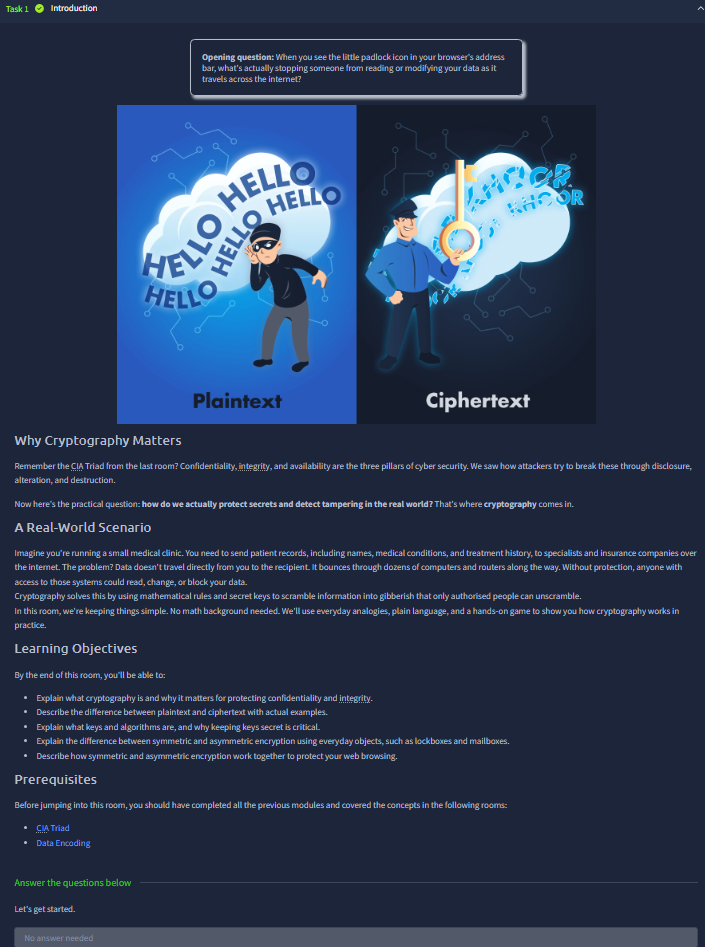
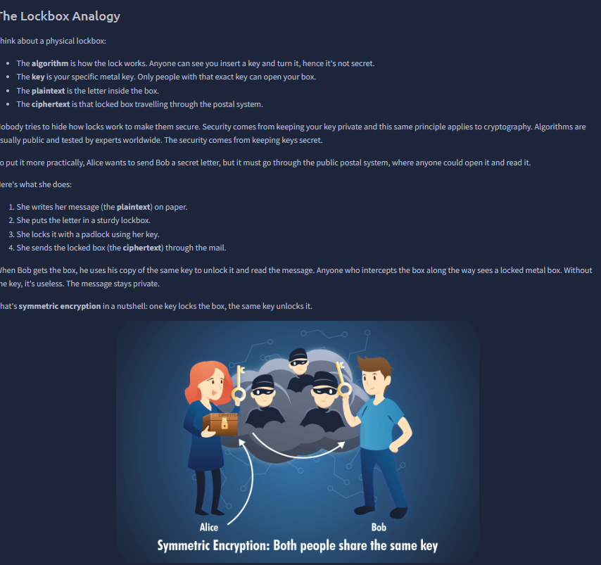
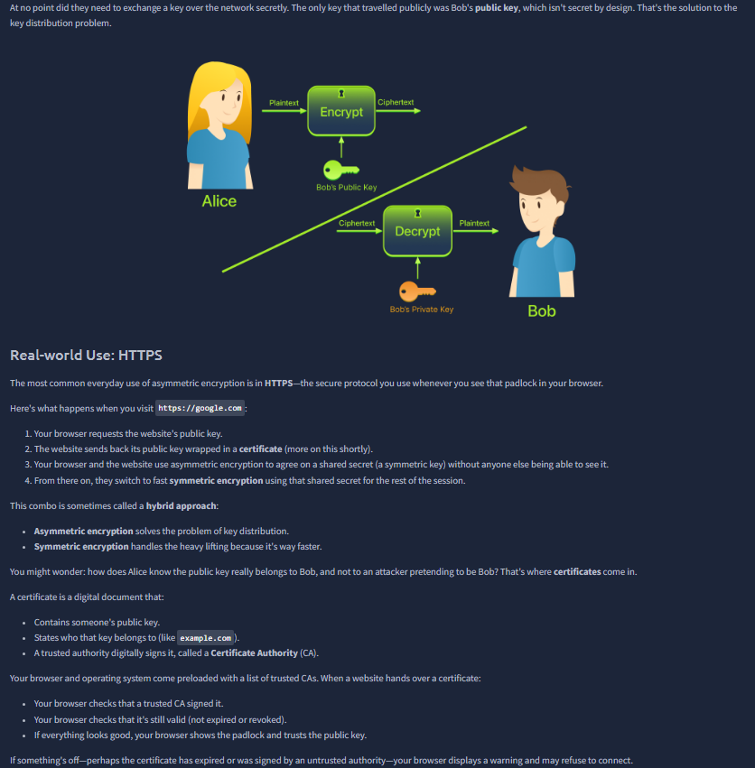



# Cryptography Concepts

Room link: https://tryhackme.com/room/cryptographyconcepts

## Executive Summary
- This room introduces the practical purpose of cryptography: protecting confidentiality, integrity, and authenticity of data in transit and at rest.
- It explains the difference between plain text and ciphertext, core encryption flow, and common algorithm families.
- For AppSec, this is a key baseline for understanding secure sessions, password storage, token signatures, and TLS trust chains.

## Walkthrough (Evidence + Analysis)

### 1) Cryptography fundamentals and threat framing

The first screenshot frames cryptography as a response to eavesdropping and tampering risks. The important takeaway is that crypto is not just "hiding text"; it is a controlled transformation process with security goals.

### 2) Plaintext -> encryption -> ciphertext model

This section visualizes the basic pipeline: readable input is encrypted into unreadable output. This mapping matters because every secure protocol (HTTPS, VPN tunnels, secure messaging) depends on this exact transformation model.

### 3) Keys and controlled decryption logic

Here the room emphasizes that encryption strength is tied to key control, not secrecy of the algorithm itself. In AppSec terms, key lifecycle (generation, storage, rotation, revocation) is often more critical than algorithm choice.

### 4) Symmetric cryptography interpretation

This screenshot covers same-key encryption/decryption behavior. The advantage is speed, which is why symmetric crypto is used heavily for bulk data. The challenge is secure key exchange, which becomes a design risk in distributed systems.

### 5) Asymmetric cryptography interpretation

This part introduces public/private key separation. It supports safer key distribution and enables identity verification patterns. This is foundational for TLS handshakes, certificate trust, and many secure auth flows.

### 6) Hashing and integrity verification

The screenshot highlights one-way hashing as a way to verify data integrity. Key point: hashes are not reversible encryption. In secure engineering, hashes are used for tamper detection and password verification (with proper salting/strong algorithms).

### 7) Signatures, authenticity, and trust

This section shows authenticity validation logic: proving source identity and message integrity. In practical AppSec workflows, digital signatures underpin software update trust, JWT-style signing models, and secure document verification.

### 8) Practical exercise and concept checks

The practical checkpoint validates if the learner can map each operation correctly (encrypt/decrypt/hash/verify). This is important because misuse of terms in real projects often leads to wrong implementations and false security assumptions.

### 9) Final consolidation of cryptography mindset

The final screenshot consolidates the room’s logic: choose the right primitive for the right goal (confidentiality vs integrity vs authenticity). This decision mindset is what directly transfers to secure system design and AppSec review work.

## Key Takeaways
- Cryptography is goal-driven: confidentiality, integrity, authenticity.
- Encryption, hashing, and signatures solve different security problems and should not be mixed conceptually.
- Secure key management is central to real-world crypto safety.
- These concepts map directly to web security controls like TLS, signed tokens, and password protection workflows.
