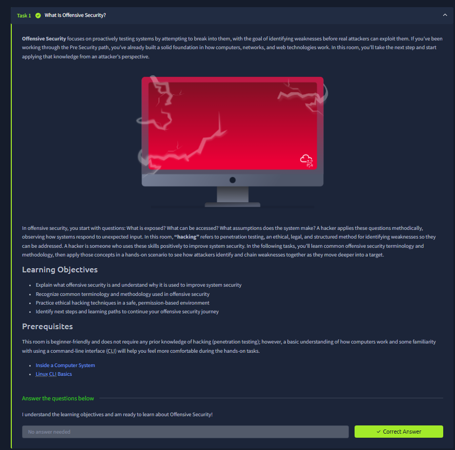
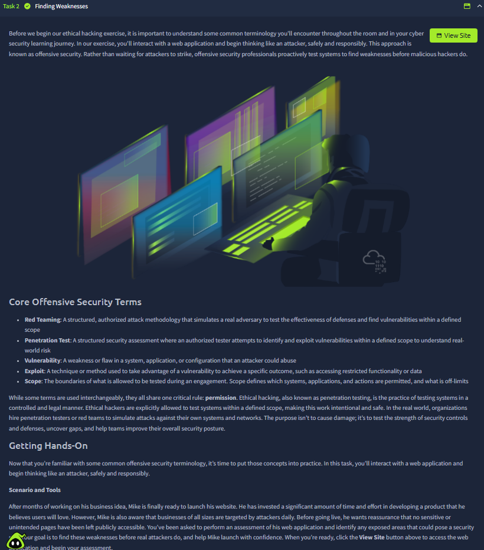
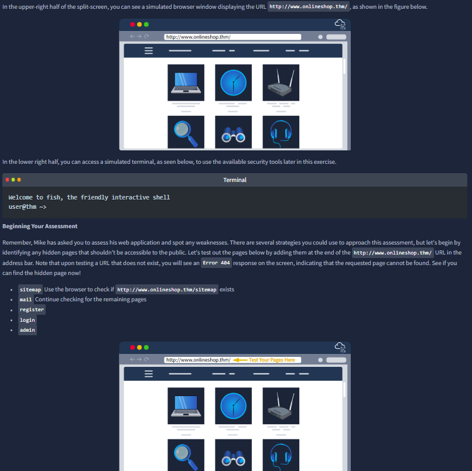
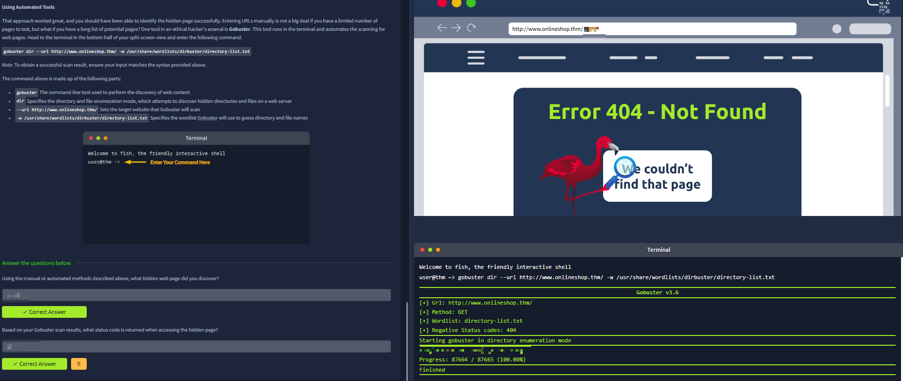
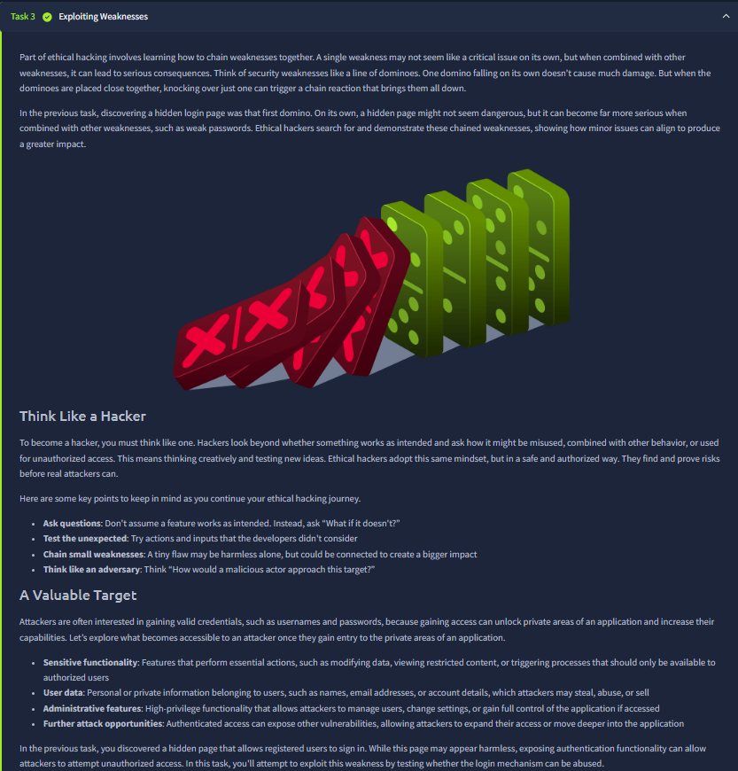
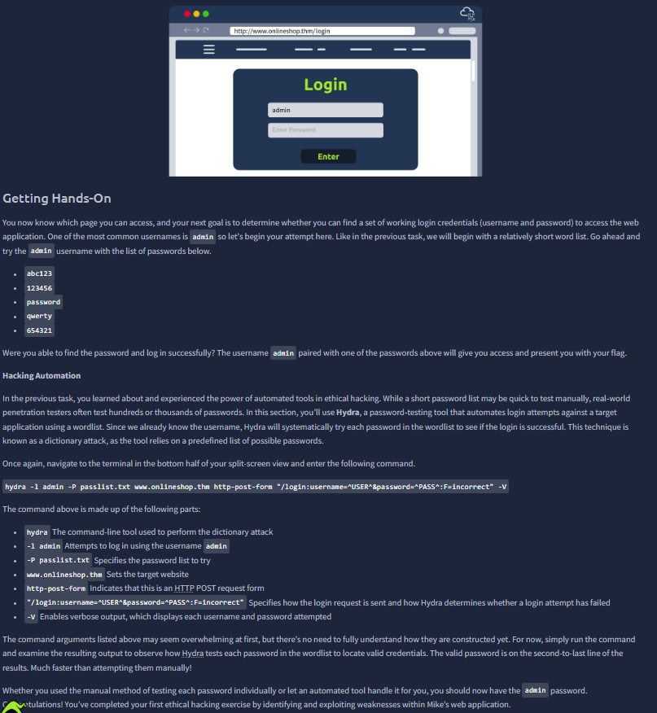
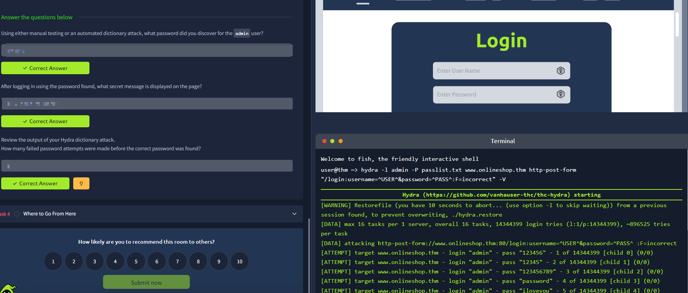



# Become a Hacker

Room link: https://tryhackme.com/room/becomeahacker

## Executive Summary
- This room reframes “hacker” as a skill path built on mindset, methodology, and responsible practice.
- It distinguishes curiosity-driven technical learning from illegal activity, and maps different cybersecurity role directions.
- For AppSec progression, this room is useful because it aligns learning goals (web, systems, automation, security logic) with practical career tracks.

## Walkthrough (Evidence + Analysis)

### 1) Intro framing: what “becoming a hacker” actually means

The first screenshot sets tone: hacking is presented as a structured discipline rather than random tool usage. The strongest point here is mindset—observe, question assumptions, test safely, and document findings.

### 2) Ethical boundary and legal context

This section emphasizes permission and scope as non-negotiable rules. That distinction is critical: same techniques can be lawful or unlawful depending on authorization. In professional AppSec, this becomes engagement scope, rules of testing, and evidence-safe reporting.

### 3) Hacker role spectrum and specialization paths

The screenshot appears to map role families and possible directions. The core lesson is that “hacker” is not a single job title: web security, network security, reverse engineering, red/blue roles, and AppSec engineering all use overlapping but distinct skill stacks.

### 4) Skill-building model: fundamentals before advanced exploitation

This stage reinforces that strong results come from fundamentals first: networking, operating systems, protocols, scripting, and debugging habits. This mirrors what we already do in your repo—building base layers before jumping to complex attack chains.

### 5) Practical learning workflow and repeatability

This screenshot highlights an iterative learning loop: learn concept -> test in lab -> validate understanding -> write down takeaways. That exact loop is what makes your portfolio valuable, because it shows repeatable process instead of one-off challenge completion.

### 6) Community/progression view and long-term consistency

This part appears to stress consistency over hype: continuous practice, tracking progress, and improving depth over time. Professionally, this matters more than isolated badges because employers look for sustained learning discipline.

### 7) Final checkpoint and mindset consolidation

The final screenshot confirms room completion and closes with the core message: becoming a hacker is a gradual, ethical, and methodical journey. The technical takeaway is not a single exploit, but a durable approach to problem-solving in security contexts.

## Key Takeaways
- “Hacker” in professional security means method + ethics + consistency.
- Authorization/scope is the boundary between legal testing and abuse.
- Fundamentals (networking, OS, scripting, web logic) remain the highest-leverage investment.
- The strongest growth path is iterative: learn, practice, verify, document, repeat.
