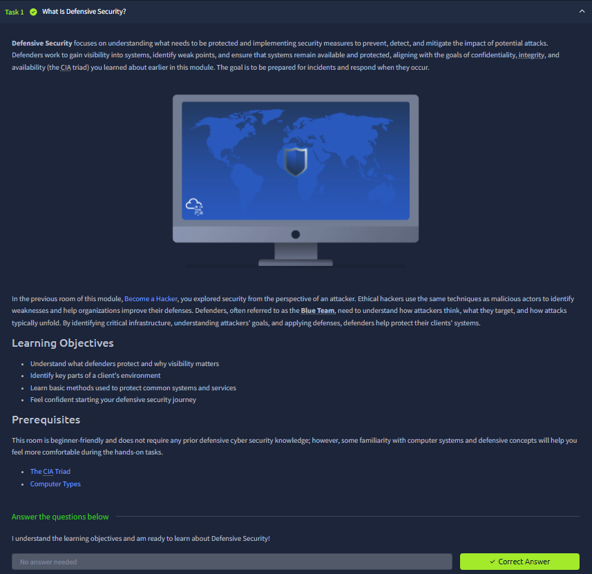
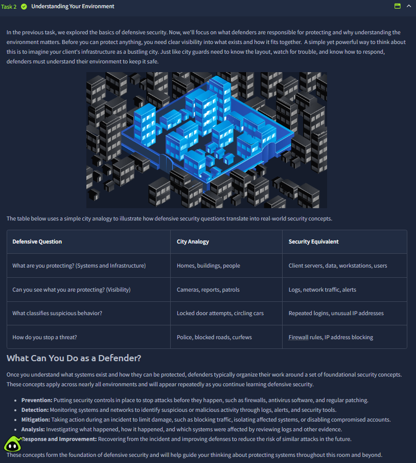
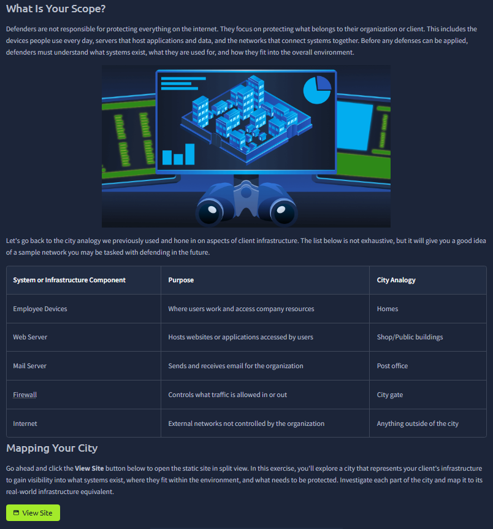
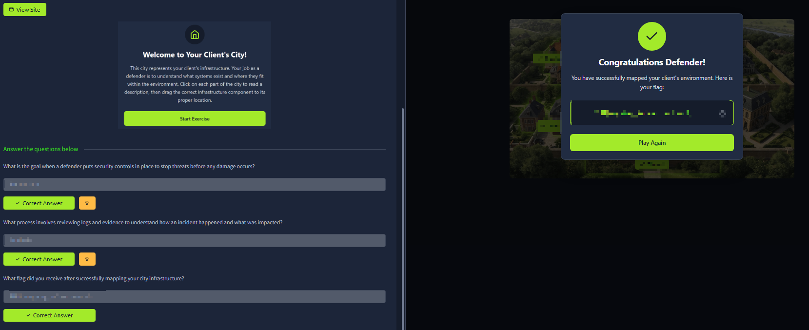
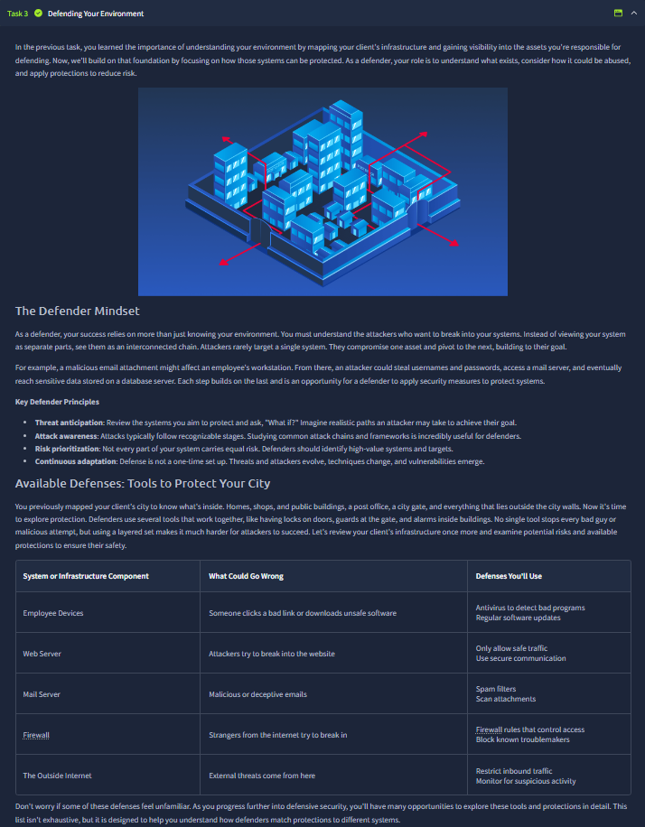
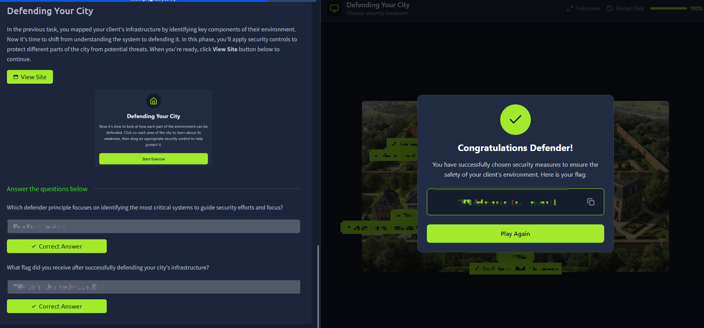



# Become a Defender

Room link: https://tryhackme.com/room/becomeadefender

## Executive Summary
- This room shifts perspective from attacker mindset to defender operations.
- It explains how organizations detect, triage, and respond to security events before they become major incidents.
- For AppSec growth, this is important because secure engineering decisions improve when we understand blue-team pain points and detection workflows.

## Walkthrough (Evidence + Analysis)

### 1) Defensive mindset introduction

The first screenshot introduces the defender role as proactive monitoring plus rapid response, not only post-incident cleanup. The key idea is prevention + detection + containment as a continuous loop.

### 2) Visibility and monitoring foundations

This section appears to focus on collecting visibility from systems/networks. Defender effectiveness starts with telemetry quality: if logs, alerts, and context are incomplete, accurate triage becomes impossible.

### 3) Alert triage and prioritization flow

Here the room shows the practical reality of handling many signals: defenders must classify severity, validate indicators, and prioritize response based on potential impact. This mirrors real SOC/appsec incident pipelines.

### 4) Incident response decision logic

This screenshot emphasizes action sequencing once suspicious activity is confirmed: contain first, investigate root cause, then recover safely. The important lesson is controlled response, not panic-driven changes.

### 5) Defensive tooling and operational collaboration

This part highlights that defender work is tool-assisted and team-based. Security tooling (alerts, endpoint/network visibility, analysis utilities) is effective only when paired with consistent procedures and communication.

### 6) Final scenario/checkpoint consolidation

The final checkpoint consolidates defender thinking: identify what happened, estimate impact scope, and choose the right next action. This strengthens the ability to connect technical signals with business risk handling.

## Key Takeaways
- Defense is a continuous process: monitor, detect, triage, respond, improve.
- High-quality telemetry and disciplined triage are central to effective incident handling.
- Containment-first response reduces blast radius while preserving investigation quality.
- AppSec engineers benefit from defender awareness because stronger prevention reduces operational incident load.
